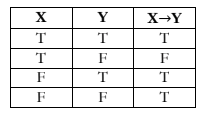

```{r,echo=F, message=F}

```

# Boyce  

## Part 1 : Axiomatic Systems, Models, & Introduction to Logic 

An **axiomatic system** is a system of statements (called _axioms_ or _postulates_) that serves as a starting point from which other statements can be logically derived. 

A **model** for an axiomatic system is a setting which assigns meaning for the undefined terms presented in the axiomatic system, in a manner that is logically consistnt with the statements in the system.

> **Existence of Lines and Circles (Euclid's first three postulates)**
>
> 1. A straight line segment can be drawn joining any two points. 
>
> 2. Any straight line segment can be extended indefinitely in a straight line. 
>
> 3. Given any straight line segment, a circle can be drawn having the segment as radius and one endpoint as center. 

- three postulates give reference to action 

Define : 

- point : an exact location in space. 

- straight line : the smallest object possible to connect two dots.  

- circle : connected points on a plane equidistant from an origin. 

- endpoint : end of a line segment. 

- radius : a straight line from the center to the circumference of a circle or sphere. 

- extended indefinitely : continue forever. 

- center : the middle of an object. 

- straight line segment : a line that is bounded by two distinct end points, and contains every point on the line that is between its endpoints.

"Foundational Concepts" about _order_ and _incidence_ :

1. Two points determine a line; every line contains at least two points, and there exist three non-collinear points. 

2. If the point B is **between** points A and C, then A, B and C are collinear. If the points A, B, and C are collinear, then exactly one of them is between the other two. 

3. Points of intersection of lines and / or circles exist if, when constructed in the plane, they necessarily cross. 

Three points in the plane A, B, C are **collinear** if one point lies on the line that connects the other two points. 

Determine : cause something to occur. 

 

- the only way for a condition statement to be false is if its hypothesis (X) is true and its conclustion (Y) is false. 

- $\lor$ : OR 

- $\land$ : AND

- $\sim$ or $\neg$ : negate

- "inclusive or" allows for both X and Y to be true at the same time 

- "exclusive or" only allows for one of them to be true

Consider If $X\Rightarrow Y$ : 

- The **negation** : If $X\Rightarrow\neg Y$.

- The **converse** : If $Y\Rightarrow X$.

- The **contrapositive** : If $\neg Y\Rightarrow \neg X$.

- The **inverse** : If $\neg X\Rightarrow \neg Y$

Two statments are **logically equivalent** if they have the same truth values. 

A **bi-conditional** statement is a statement of the form X if and only if Y, sometimes denoted $X\leftrightarrow Y$. This means both if X then Y and if Y then X. 

- true if both conditional statements are true

- false if both conditionals statements are false 

## Part 2 : Transformations and Congruence 

## Part 3 : Synthetic Geometry 

## Part 4 : Area and Perimeter

## Part 5 : Similarity 

## Part 6 : Circles 

## Part 7 : Geometry of Position 

## Part 8 : Introduction to TaxiCab Geometry 

## Part 9 : Circle Inversions and Hyperbolic Geometry 

## Part 10 : Spherical Geometry 

# Barsamian 

## 1 : Axiom Systems 

Assumed Statements : 

- The set of integers is closed under addition and multiplication 

- There is a special number called 1 with the following properties

  - 1) 1 is not equal to 0. 
  
  - 2) For all integers $n$, $n\cdot1=n$.
  
Both of the above assumptions can't be proved, but nothing in math would be true if these were false. 

Axioms sometimes referred to as postulate, and will be closed in angle brackets <1>. 

- axioms are hypotheses of each theorem proved

- if assumed axioms are assumend, then assumed statement would be implied. 

"is related to" is an example of an undefined relation on the set of integers, sometimes called a _primitive relation_.

$_5R_7$ means "5 related to 7"

> A relation on a set is said to be _symmetric_ if it has the following propery :
>
> _For all elements a and b in the set, if a is related to b, then b is related to a. 

> A relation is said to be transitive if it has the following property : 
>
> _For all elements a, b, and c in the set, if a is related to b, and b is related to c, then a is related to c._

T.1 is an exsitence statement so it's proof starts by using the only axiom that is also an existence statement. 

Theorems are true by the simple fact of the axioms and the rules of logic, and nothing else. 

(1.1.7 end of page 18)

## 10 : Euclidean Geometry II : Similarity 

### Parallel Projections 

### Similarity 

### Applications of Similarity 

# Aftick 

## 4 : Similar Triangles 

### Proportions 

### Similar Triangles 

### Transversals to Three Parallel Lines

### Pythagorean Theorem 

### Special Right Triangles 

### Distance from a Point to a Line 

