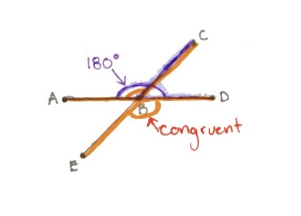

```{r setup, include=FALSE}
knitr::opts_chunk$set(echo = TRUE)
```

_Answer the following questions. You are encouraged to work with other students and to seek help from the instructor while working on these problems, but please write up your answers on your own._

# 1. (Boyce 2.1) Look at these axioms for length: 

> **Axioms of Length:** Each segment $\overline{AB}$ can be assigned a positive number, called the **length** of $\overline{AB}$, denoted AB, such that the following properties hold: 
>
> - The length of the unit segment is 1.
>
> - AB = BA
>
> - If A, B, C are three points with B between A and C, then AC is $\underline{\text{equal}}$ to AB+BC. 
>
> - There exists a uniques point M between A and B, called _midpoint_ of $\overline{AB}$, such that $AM=MB$

## Suppose $A=B$. What number must be assigned as the measure of "segment" $\overline{AB}$ in order to be consistent with the axioms of length? Explain why assigning any other number would result in a contradiction to one or more of the axioms of length. 

0 is the only measure of "segment" of $\overline{AB}$ that would be consistent with each axiom. 

(i) $A=B$ reads to me as two points in the same spot. If there were a distance between these two points then the unit segment would not be 1.  

(ii) $AB=BA\Rightarrow0=0$

(iii) Define C as a point between A and B. Then $AC=AB+BC\Rightarrow0=0+0$, because all three of these points are in the same spot with no measure for length between any of them. 

(iv) Similar to (iii), m is a point between A and B called the midpoint of $\overline{AB}$ such that $AM=MB\Rightarrow0=0$. 

# 2. (Boyce 2.2) Look at these axioms for angle measure: 

> **Axioms of Angle Measure:** Every minor angle $\angle ABC$ can be assigned a positive numeber between 0 and 180, called the drgree measure of the angle, so that the following properties hold: 
>
> - The degree measure of a right angle $90^o$.
>
> - Meausure of $\angle ABC=$ Measure of $\angle CBA$
>
> - If point D is in the interior of $\angle ABC$, then the measure of $\angle ABC$ is equal to the sum of the measures of $\angle ABD$ and $\angle DBC$
>
> - There exists a unique ray that is the angle bisector of $\angle ABC$.

## Suppose $A=C$. What number must be assigned as the measure of $\angle ABC$ in order to be consistent with the axioms of angle measure? Why? 

0 is the only measure of $\angle ABC$ that would be consistent with all of the axioms of angle measure. 

(i) Since $A=C$, then $\angle ABC$ would more accurately be represented as the line $\overline{AB}$ or $\overline{CB}$ with zero angle. If there were a measurement for angle here then, the measure of a right angle would not be $90^\circ$.

(ii) $m\angle ABC=m\angle CBA\Rightarrow0=0$. 

(iii) If point D is in the interior of $\angle ABC$, then $m\angle ABD+m\angle DBC=m\angle ABC\Rightarrow 0+0=0$. 

(iv) The unique ray that is the angle bisector of $\angle ABC$ is also zero, since A and C are in the same spot. 

# 3. (Boyce 2.3) Prove that two segments are congruent if and only if they have the same length. 

$\underline{\text{Proof:}}$

1. $\overline{AB}\cong \overline{CD}\Rightarrow AB=CD$.

Suppose $\overline{AB}\cong \overline{CD}$. 

Then there is an isometry that superimposes $\overline{AB}$ on $\overline{CD}$. 

So let $f$ be that isometry : $f(\overline{AB})=\overline{CD}$. 

Isometries preserve distance. 

The length of $f(\overline{AB})$ equals the length of $\overline{AB}$. 

So by substitution $CD=AB$.

2. $AB=CD\Rightarrow\overline{AB}\cong \overline{CD}$

Suppose $AB=CD$. 

There is a translation along the $\overrightarrow{\rm v}$ from A to C, $f_1(A)=C$. 

Then $f_2$ rotates $f_1(\overline{AB})$ by $\theta = \angle DCf_1(B)$, center $f_1(A)$. 

Then by the definition of rotation then $f_2(f_1(B))=D$ takes $f_2(f_1(\overline{AB}))=\overline{CD}$.

Therefore they are congruent. $\quad\quad\square$

# 4. (Boyce 2.6) Suppose $\angle ABC$ and $\angle CBD$ are supplementary, and $\angle ABC \cong\angle EBD$. Prove $\angle ABE\cong\angle CBD$. (Feel free to use the Congruence and Angle Measure Theorem)

$\underline{\text{Proof:}}$

1. $\angle ABE\cong\angle CBD\Rightarrow m\angle ABE=m\angle CBD$. 

Suppose $\angle ABE\cong\angle CBD$.

There is an isometry that superimposes $\angle ABE$ onto $\angle CBD$. 

Let $f$ be that isometry : $f(\angle ABE)=\angle CBD$. 

Isometries preserve angle. 

The angle measure of $f(\angle ABE)$ equals the angle measure of $\angle CBD$. 

So by substitution $m\angle ABE=m\angle CBD$.

2. $m\angle ABE=m\angle CBD\Rightarrow \angle ABE\cong\angle CBD$.

Suppose $m\angle ABE=m\angle CBD$. 

There is a rotation $f_1(m\angle ABE)$ about B by $\theta=180^\circ$. 

Then by the definition of rotation $f_1(m\angle ABE)=m\angle CBD$. 

Therefore $\angle ABE\cong\angle CBD\quad\quad\square$.

```{r, echo=F, out.width="80%", fig.cap="Image of Problem 4", fig.align="center"}

```

