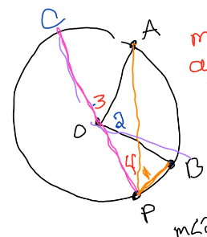

```{r,echo=F, message=F}

```

# W6D11: Feb. 8th, 2022 

Email professor with exam questions. 

## Dilation 

Pick a center P, and "scaling factor" k. 

### Three cases 

for k>0

- k > 1 , expanding 

- k < 1 , shrinking 

- k = 1 nothing 

Q goes to $Q'$ on $\overrightarrow{PQ}$ where $\overline{PQ'}=k\overline{PQ}$.

- stays on same ray 

### Does Dilation Change Angles

No. When you scale from a center your angles stay the same (with congruent measures). 

Morale: Scale / Dilate using vertex of angle as center, angles don't change. 

## Similar

Two figures are similar if one can be superimposed on the other by a dilation and then an isometry. 

When things are similar then they are also proportional 

Notation: $\sim$

### Theorem: (AA Similarty Theorem)

If $\triangle ABC$ and $\triangle DEF$ satisfy 

- $\angle ABC\cong \angle DEF$ and 

- $\angle BCA\cong \angle EFD$

Then $\triangle ABC\sim \triangle DEF$
  
Note: $\angle CAB\cong \angle FDE$ is automatically true (AAA)

### Proof

Let ABC and DEF be triangles with $\angle BAC \cong \angle EDF$.

First: AB, DE > 0 

Apply dilation to $\triangle ABC$

- center = A

(note math is easier if you pick a point on the triangle ABC)

- scale factor = $k=\frac{DE}{AB}$

A'= A (doesn't move if it is the center)

B'=  $\rightarrow$ $AB'=k\cdot AB=DE$

Plan: If $\triangle A'B'C'\cong\triangle DEF$ then $\triangle ABC\sim \triangle DEF$. 


We think $\overline{AB}$ is parallel to $\overline{B'C'}$ so $\angle AB'C'\cong \angle ABC$ (corresponding). 

By ASA we know $\triangle A'B'C'\cong\triangle DEF$, therefore $\triangle ABC\sim \triangle DEF$.

## Theorem: SAS Similarity Theorem

If $\triangle ABC$ and $\triangle DEF$ satisy 

- $\angle CAB\cong \angle FDE$ and 

- $\frac{AB}{DE}=\frac{AC}{DF}$

then $\triangle ABC \sim \triangle DEF$. 

Proof: 

1. Dilation (pick center k)

2. Congruence Theorem 

Imagine a center point P, and two points A and B. 

It makes sense that if you dilate A to A' and B to B' then $\angle ABC\cong \angle A'PB'$ because they are stayingon the same rays. 

Similarly we can say $\angle PBA\cong \angle PB'A'$. 

Imagine we did a translation moving A, B by $\overrightarrow{BB'}$. 

- P stays on $\overleftrightarrow{BB'}$

We know that A'' is from the translation, and we know that that is an isometry which preserves angle and length. Therefore then angles are the same. 

Break... 

## Circles 

(Section 6 of Boyce notes)

**Circle:** center, radius 

Points on circle have distance r from the center point O. 

**Unit Circle:** radius length 1.

**Arc:** a connected subset of the points on circle.

**Chord:** line segment connecting 2 points on circle. 

**Central Angle:** vertex is center of circle, rays intersect in 2 different points.


$\angle HGI$ is a central angle. 

**Inscribed Angles** vertex is on circle, rays intersect circle in 2 points. 


$\angle LKM$ is an inscribed angle 

**Inscribed:** verities on circle. 

For an inscribed square, all four points of a square are on the circle.

**Tangent Line:** Line that intersects circle at only 1 point. 

**Radian:** measure of the central angle in a unit circle with arc length of 1. 

There will be a bonus opportunity involving radians. 

## Circle Questions 

Pick 2 points A and B on a circle. 


1. How many (minor) central angles go through A, B? 

      One. 
      


2. How many inscribed angles go through A B? 

      A lot. 
      
      
3. Relationship between minor angle and inscribed angle? 

    The minor angle is twice the size of the inscribed angle. 
    


### Extra Credit 

Figure out whats wrong with the theorem below and correct it: 

**Inscribed Angles Theorem** Let P, A and B be points on a circle with cnter 0, and let Q be a point on the circle that is not an arc APB. Then $\angle APC$ is one half the measure of the arc AQB. 

Note: you need to talk about length too, not just talk about angles. 


# W6D12: Feb. 10th, 2022

### Homework 4 

Will allow corrections on HW 4 up until next Wednesday. 

Interesting strategy for 1 was to have case 1: right triangle (only 1 rectangle), case 2: general triangle (has two right triangles within it). 

This is a useful proof strategy. 

If you are using that the bisectors or a rhombus are perpendicular you need to state where we proved that in class or in another homework. 

### Circle Theorem


Conjecture: $m\angle AOB= 2 m\angle APB$

### (6.1) Inscribed Angle Theorem


Suppose A , B on a circle with center O and P is a point on a circle not in interior of $\angle AOB$ then $m\angle AOB=2m\angle APB$ (central = 2 inscribed)

**Case 1:** Right Central Angle 


The radius of the circle forms triangles with the same side lengths, because the sides are the radius (which remains the same). So, $\overline{AO}=\overline{BO}=\overline{PO}$ and $m\angle APO = m\angle PAO$

We also know that the sum of the interior angles of a triangle adds up to $180\circ$, therefore $90^\circ = m\angle AOB= 2m\angle APB$. 

**Case 2:**


central = $m\angle 1 + m\angle 2$

inscribed = $m\angle 3 + m\angle 4$

From Case 1, we know that $m\angle 1 = 2m\angle 3$ and $m\angle 2 = 2m\angle 4$. 

Therefore $m\angle 1+m\angle 2 = 2m\angle 3+ 2m\angle 4=2(m\angle 3+\angle 4)$. 

Meaning our Central angle is 2 times the inscribed angle. 

**Case 3:** 



$\angle$ 1: inscribed angle 

$\angle$ 2: central angle 

Notice that $m\angle 3 = 2m\angle 4$. 

Also that $m\angle 2 + m\angle 3$ is a central angle, and $m\angle 1 +m\angle 4$ is inscribed. Meaning then that $m\angle 2 + m\angle 3 = 2(m\angle 1 + m\angle 4)$. 

We can then show,

$m\angle 2 + m\angle 3 = 2(m\angle 1 + m\angle 4)$

$m\angle 2 + 2m\angle 4 = 2m\angle 1 + 2m\angle 4$

$m\angle 2 = 2 m\angle 1$

Summary 


### Corollary

Any two inscribed angles have the same arc on the circle are congruent. 


### Power of the Point Theorem 1

(6.6) Power of a Point 1. 


If $\overline{AB}$ and $\overline{CD}$ are chords of circle intersecting in x inside circle. Then $AX\cdot XB = CX\cdot XD$. 

Proof: 


By Inscribed Angle Corollary we see that $\angle 1 \cong \angle 2$ because they share the same arc on the circle. 

By Vertical Angle Theorem we can say that $\angle 3 \cong \angle 4$. 

By Inscribed Angle Theorem $\angle 5 \cong \angle 6$. We can also say that both triangles need to add up to $180\circ$, and therefore they are congruent. 

Therefore by AA Similarity Theorem $\traingle AXD \sim\triangle CXB$.

Since these two triangles are similar we know these two triangles are proportional (Don't know scaling factor k). 

$AX=KCX$

$XD=KXB$

$\frac{AX}{XD}=\frac{kCX}{kXB}=\frac{CX}{XB}$

$\frac{AX}{XD}=\frac{CX}{XB}$

(Get rid of fractions)

$AX\cdot XB=CX\cdot XD$

$\square$

### Power of a point II Theorem

P is outside of a circle, and draw 2 rays from P: 

1 intersecting A and then B

2 intersects C and D. 

Then, $PA\cdot PB= PC\cdot PD$. 

(Note: If P were X insides the circle then this is I)

Hint: Order matters, and drawing triangles will help (see image below). 


By AA similarity $\triangle PCB \sim \triangle PAD$. 

$\frac{PC}{PB}=\frac{PA}{PD}$ (cross multiply : butterfly diagnolization)

$PA=kPC$ and $PD=kPB$

$PA\cdot PB=PC\cdot PD$. 

$\square$.

This is the end of Euclidean Geometry. 

# <span style="color: darksalmon;">W7D13: Feb. 15th, 2022</span>

### HW 5 Problem 3


Can't assume pink line C'B' is parallel to CB. 

1 option: SAS $\Rightarrow$ $\triangle ABC\sim A'B'C'\Rightarrow B'C'=kBC$.

### HW 6

For 1 and 2, inscribed angle theorem (or it's corallary).

For 3, even though we didn't prove it, using Boyce 6.5 (Lemma) will make this problem very easy. You also get to pick two more points on the circle. 

Note: A lemma is a piece of a theorem you prove first. 

## Analytic Geometry 

Axiomatic Geometry: Start with axioms $\rightarrow$ theorems. 

Analytic Geometry: Coordinates and functions. 

Preview: Euclids parallel lines $\rightarrow$ don't intersect. 

Q: What if space isn't flat? i.e. Earth 

- longitude (parallel that intersect)

- On a sphere angles in a triangle don't add to $180^\circ$. 

## Isometries as Functions 

Isometries: rotations, reflections, and translations that preserve distance, length, and angle measure. "rigid motion" 

Isometries as functions,  

In the plane: $F:\mathbb{R^2}\rightarrow \mathbb{R}^2$

$F((x,y))=(z,w)$

Domain: $\mathbb{R}^2$ 

Range: $\mathbb{R}^2$ (can plug in anything and doesn't leave anything out)

Ex: (Not Isometry) $F(x,y)=(\frac{1}{x},\frac{1}{y})$

Domain: anything with a zero is not in the domain or range. 

Ex: (Not Isometry) $F(x,y)=(2x,2y)$

Domain = Range = $\mathbb{R}^2$

However this does not preserve distance. 

### One-to-one

one-to-one: no two things in the domain get sent to the range. 

If $F(x,y)=F(z,w)$ then $(x,y)=(z,w)$

Conjecture: Isometries are one-to-one. 

Proof by contradiction. 

Imagine $(x,y)\ne (z,w)$ by $F(x,y)=F(z,w)$. 

If $F(x,y)=F(z,w)$ the distance from $F(x,y)$ to $F(z,w)$ is 0. But the distance from $(x,y)$ to $(z,w)$ wasn't 0. 

### Onto

Hit's everything in the codomain. 

$F:\mathbb{R}^2\rightarrow \mathbb{R}^2$ 

Everything in the codomain (Range) has to get sent back to the domain. 

Range = $\mathbb{R}^2$. 

Isometries are also onto! 

Bijection: one-to-one and onto 

### Isometries

Isometries = $\{F:\mathbb{R}^2\rightarrow\mathbb{R}^2|\text{bijections that preserve distance and angle measure}\}$. 

$S=\{F:\mathbb{R}^2\rightarrow \mathbb{R}^2|\text{bijections that preserve distance and angle measure}\}$

Set of Isometries

- translations

- rotations

- reflections 

- and "compositions" (doing one and then another)

### Activity 1: Classify Isometries

Classify each of the folloing as a translation ,rotation, reflection, or none of the above. 

1. $F(x,y)=(x,-y)$: Reflection across x

2. $G(x,y)=(y,x)$: Reflection across f(x)=-x

3. $H(x,y)=(x-1,y+2)$: Translation 

4. $J(x,y)=(2x,y)$: Not an isometry

## Fixed Point Theorem Part 1

If F, an isometry, fixes points A and B, then F fixes all points on $\overleftrightarrow{AB}$. 

(once you fix two points, you fix every point on that line)

Explanation: $A=(x,y)$

F fixes A $\Rightarrow F(x,y)=(x,y)$

Proof: Suppose A, B are fixed by isometry F. F fixes all points on $\overleftrightarrow{AB}$. Let C be on $\overleftrightarrow{AB}$. 

Wherever $F(C)$ is, 

- $m\angle ACB=180^\circ\text{ or }0^\circ$

- $m\angle F(A)F(C)F(B)=180^\circ\text{ or }0^\circ$

$\rightarrow F(C)$ is on $\overleftrightarrow{AB}$.

Also $F(C)A=CA$ and $F(C)B=CB$

There are exactly 2 points on $\overleftrightarrow{AB}$ with distance CA from A: 

- one has distance > BA

- one has distance < BA 

So they're different so only 1 is dist CB from B. So $F(C)=C$.

F fixes all points on $\overleftrightarrow{AB}$. 

Picture: 


This whole thing fails if A=B, then there is no line $\overleftrightarrow{AB}$.

# <span style="color: darksalmon;">W7D14: Feb. 17th, 2022</span>

### Another hint on HW6 Problem 3


### Quiz 2

Available starting tomorrow, and due next Friday. 

Focus is on the presentation. Ask Becca if you have questions. 

### Theorem (Boyce 7.7)

Isometries map lines to lines. 

- rotation 

- refection 

- translation 

Proof: Suppose $\overleftrightarrow{AB}$. Let C be a point on $\overleftrightarrow{AB}$. Let F be an isometry. 

- $m\angle ACB=180^\circ$ or $0^\circ$

- $m\angle F(A)F(C)F(B)=180^\circ$ or $0^\circ$

because a use F preserves angle measure. 

Then F(C) is on $\overleftrightarrow{F(A)F(B)}$.

"All isometries send lines to lines"

### Symmetries

Last time: The set of isometries with composition is a group. 

(0) Closure (order doesn't matter)

(1) Associativity (parentheses don't matter)

(2) Identity $e=F(x,y)=(x,y)$

(3) Inverses (undoes isometry)

Now: A $\underline{\text{symmetry}}$ is an isometry that sends a geometric figure to itself. 

Ex: If you rotate a circle from its origin $90^\circ$, where does it end up? The points on the circle move, but the circle itself does not move. This is an example of a symmetry. 

Symmetries can be:

- Translations:  $\tau_{AB}$ moves A to B

- Rotations: $R_{c,\alpha}$, c center, $\alpha$ angle

- Reflections: $r_m$, m is line being reflected over

- compositions of these 

### Questions

What symmetries would a line have?

- one reflection over a line that's perpendicular to it

- translations along the vector of the line (any direction that's parallel)


Every point can be shifted to the right infinity. 

Paradox: A hotel with infinite rooms is booked and someone comes to check in. Where do they put them? You move everyone a room to the right and put them in the first room. 

What symmetries would a circle have? 

A circle has infinite axes of symmetry. 

### Equilateral Triangle

All sides are equal length. 


**Goal 1:** List symmetries 

Rotations: 


- $R_{c,120^\circ}$: $120^\circ$ about the center of the triangle

- $R_{c,240^\circ}$: $240^\circ$

- $R_{c,3}$: $e=360^\circ$

Translations

- e

Reflections 


3 angle bisectors (isosceles theorem)

- $r_{m_1}$, $r_{m_2}$, $r_{m_3}$

Symmetries: e, $R_{c,120}$, $R_{c,240}$, $r_{m_1}$, $r_{m_2}$, $r_{m_3}$

Question 1: Are any of these the same? 


Question 2: Did we miss any? 

No, $3!=3\cdot2\cdot 1=6$

$\quad 1\rightarrow 3$ choices

$\quad 2\rightarrow 2$ choices

Note: There are **not** $4!=24$ symmetries of a square. 


$\quad 1\rightarrow 4$ choices

$\quad 2\rightarrow 2$ choices

$\quad 3\rightarrow 1$ choices

$\quad 4\rightarrow 1$ choices

$4\cdot 2\cdot 1\cdot 1= 8$ choices

Hint for HW: n-sides regular polygon: 2n symmetries

**Goal 2:** This set is also a group. 

$\mathscr{S}=\{e,R_{c,120^\circ}, R_{c,240^circ},r_{m_1}, r_{m_2},r_{m_3} \}$

Claim $\mathscr{S}$ is a group under composition.

Proof: 

(0) Closure: If I compose 2 symmetries, I get a symmetry. 

Let our triagle be $\triangle 123$ and suppose F and G are $\mathscr{S}$: $$F\circ G(\triangle 123)=F(G(\triangle 123))=F(\triangle 123)=\triangle 123$$

Ex. $R_{c,120^\circ}\circ r_{m_1}=r_{m_3}$


In principle:

- if you compose two rotations you get a roations

- if you compose a rotation and a reflection you get a reflection 

- if you compose two reflections you'll get a reflections 

(1) Associative: 

$F\circ(G\circ H)=(F\circ G)\circ H$

\begin{equation}\label{D14,1}
\begin{split}
F\circ(G\circ H) &= F\circ (G\circ H)(\triangle 123)\\\
&= F(G\circ H (\triangle 123))\\
&= F(G(H(\triangle 123)))\\
&= (F\circ G)\circ H(\triangle 123)
\end{split}
\end{equation}

(2) Identity: e

example: $e=r_{m_1}\circ r_{m_2}$

(3) Inverses: 


Question: If $\triangle 123$ was no equillateral would it still have all these symmetries? 

Answer: No, 

Ex. Isosceles only has two: $e, r_{m_3}$ 

### Homework 7, Problem 4

If p is an n-sided regular polygon (all angles and sides are equal)

- How many symmetries does it have? 

- are they a group? 

Hint (2n)

# W8D15: Feb. 22nd, 2022

For Quiz looking more at problem 1 then 2. Just follow what we did in class for #2, but use a lot of time with 1. 

## Euclidean distance in $\mathbb{R}^2$

Also call Euclidean metric in $\mathbb{R}^2$, where for our course we can think of metric as distance. 

If $A=(x_A,y_A)$, $B=(x_B,y_B)$ in $\mathbb{R}^2$. 

$d_E(A,B)=\sqrt{(x_B-x_A)^2+(y_B-y_A)^2}$

Q: What does this have to do with Euclidean Geometry? 


## Pythagorean Theorem 

$c^2=a^2+b^2$

Proof Ingrediants: 

- Area Axioms 

  - (4) Area of rect. was $b\times h$
  
      - Area of triangle $\frac{1}{2}b\times h$
      
      - Our right triangle $\frac{1}{2}a\times b$
  
  - (2 or 3) Add Areas 
  
Proof: 


Big "square": $(a+b)^2=a^2+2ab+b^2$

- all sides $a+b$, angles all $90^\circ$.

Little "square": 

- all sides are c

- area: $c^2$

By axiom 3: Big square = little square + 4 triangles. Therefore, 

$$a^2+2ab+b^2=c^2+4(\frac{1}{2}ab)$$

$$\Rightarrow a^2+b^2=c^2$$

## Taxicab Geometry 

Idea, distance lives on a grid. 


Q: Can you find other paths of length 5? 


Living on an integer grid, what is the Taxi Cab distance formula?

$d_T=|x_B-x_A|+|y_B-y_A|$

## Theorem 

For all A, B in $\mathbb{R}^2$ $d_E=(A,B)\leq d_T(A,B)$.


Lemma: If x, y are in $\mathbb{R}^+$ then $x-y\geq 0$ if and only if $x^2-y^2$. 

Proof: $x^2-y^2=(x-y)(x+y)$ so 

\begin{equation}\label{D15.1}
\begin{split}
x^2-y^2\geq 0 &\Leftrightarrow (x-y)(x+y)\geq 0\\
&\Leftrightarrow x-y\geq 0
\end{split}
\end{equation}

Theorem: $d_E=(A,B)\leq d_T(A,B)$

Proof: 

$d_E(A,B)=\sqrt{(x_B-x_A)^2+(y_B-y_A)^2}$

$d_T=|x_B-x_A|+|y_B-y_A|$

We want to show: $d_T(A,B)-d_E(A,B)\geq 0$

By lemma this is the same as proving 

$d_T^2(A,B)-d_E^2(A,B)\geq 0$. 

\begin{equation}\label{D15.2}
\begin{split}
d_T^2(A,B)-d_E^2(A,B) &= (|x_B-x_A|+|y_B-y_A|)^2-(\sqrt{(x_B-x_A)^2+(y_B-y_A)^2})^2\\
&= |x_B-x_A|^2+2|x_B-x_A||y_B-y_A|+|y_B-y_A|^2-[(x_B-x_A)^2+(y_B-y_A)^2]\\
&= 2|x_B-x_A||y_B-y_A|\quad\quad\text{, because}|x|^2=x^2\\
&\geq 0\quad\quad\text{, because of the absolute values}
\end{split}
\end{equation}

Q: When is $d_T=d_E$? 

Note: $d_T^2-d_E^2=2|x_B-x_A||y_B-y_A|=0?$

A: It's when $x_B=x_A$ or $y_B=y_A$.

- If $x_B=x_A$ then A, B are on the same vertical line.  

- If $y_B=y_A$ then A, B are on the same horizontal line. 

## Circles in Taxicab Geometry

In Euclidean geometry a circle is defined as a set of points who distance from ceneter O is r (radius). 

If $0=(x_0,y_0)$

Circle $=\{(x,y)|d_E((x,y),(x_0,y_0))=r\}$

Example: 

Circle $=\{(x,y)|d_E((x,y),(0,0))=2\}$

How many points are on the circle? 

$\infty$

Taxicab Circles: (integers)

Circle $=\{(x,y)|d_T((x,y),(x_0,y_0))=r\}$


Moral: Taxicab circle are squares!

$d_T(|\frac{1}{2}-0|+|\frac{1}{2}-0|)=1$

Q: What is taxicab $\pi$?

Euclidean $\pi\approx 3.14....$ irrational (transcendental) number. 

Circle: circum: $2\pi r$ and area $\pi r^2$

$\pi=\frac{\text{circumference}}{\text{diameter}}$

Maybe for $d_T$, $\pi\ne 3.14$

### Example 

Center (0,0) with r = 1


Diameter = 2

Circumference = 8

Taxicab = $\pi=\frac{\text{circumference}}{\text{diameter}}=4$

### Example 

Center (0,0) with r = 3

Diameter = 6

Circumference = 24


$\pi=\frac{\text{circumference}}{\text{diameter}}=4$

Fact: Taxicab $\pi$ is 4. 

Next weeks homework: you are going to try to figure out what a radian is. 

For a unit circle a radian is defined as an angle with an arc length of 1. 

Circle with radius r: radian is angle that corresponds with arc length r. 

HW: What is 1 radian = ????

Euclidean geom: 1 radian: $\frac{180}{\pi}$


# W8D16: Feb. 24th, 2022

Last homework is optional for feedback. Can only bring your homework grade up, not down. 

### Taxicab Geometry Review

For $A=(x_a,y_a)$ and $B=(x_b,y_b)$ then, 

Euclidean: $d_E=\sqrt{(x_b-x_a)^2+(y_b-y_a)^2}$

Taxicab: $d_T=|x_b-x_a|+|y_b-y_a|$

Also, $d_T\geq d_E$.

Note:  Two distances will match up if they are on the same horizontal or verticle line. 

Circle: $\{(x,y)|d_T((x,y),(x_0,y_0))=r\}$

Circles in taxicab geometry are squares. 

Pi: $\pi_T=4$

Radians: have nice values too (will figure out on HW)


### Triangles in Taxicab

2 frameworks

1. Draw normal triangles, and use $d_T$ (taxicab metric) for length. 

2. Pick three points and draw taxicab grids, but you can't talk about angles. (we won't use this one)

Question: When are 2 triangles (or any shape) congruent? 

Answer: When there is an isometry that superimposes 1 on the other. 

An isometry is a transformation that preserves distance and angle measure.

- angle measure will stay the same

- we have change distance in taxi-cab geometry

Euclidean world: 

- translation

- rotations 

- reflections 

- combinations 

### Ex. Rotate a line $90^\circ$


### Ex. 


Taxicab: No SAS!!! 

### Goals

Looking at the list of translations, roations, and reflections, which of these work in taxicab geometry? Which work all or the time? some of the time? never? 

1. Translations

Start with 1 Translations 

$A=(x_a,y_b)$ translate by $(z,w)$ 

$\quad\rightarrow$ A moves to $(x_a+z,y_a+w)$


$d_T=|x_b-x_a|+|y_b-y_a|=|x_b-x_a|+|y_b-y_a|$

Translations preserve taxicab distance!!! 


2. Rotations 

Rotations doesn't always work. 

- ex: length changed after $45^\circ$ rotation. 

Let's try $90^\circ$

- ex: 

Conjecture: Rotating by $90^\circ\times$ integer is a taxicab isometry. 

Why is this true? 


3. Reflections


### Isometries for taxicab:

- translations 

- rotations by $90^\circ k$ where k integer

- reflections over y=0, x=0, y=x, or y=-x

- combinations 

### Rest of course

Euclid's axioms $\rightarrow$ 5

Given a line and a point not on the line, you can draw exactly 1 line thru that point, parallel to the first line. 

Non Euclidean Geometry: 

Given a line, and a point not on that line 

- $\underline{\text{Spherical}}$ geometry: no lines drawn thru that pt that won't intersect 1st line. ($>180\circ$)

- $\underline{\text{Hyperbolic}}$ geometry: more than 1 line thru that pt that doesn't intersect the 1st line. ($<180\circ$)

### Taxicab Land

- A triangle where 2 sides don't add up to more than the 3rd side. 

Draw and give specific coordinates for:

-  2 triangles congruent in both Euc. and Taxicab geomety if possible. (If not explain why)

- 2 triangles congruent in Euc. geometry and not taxicab if possible. 

- 2 triangles congruent in taxicab but not Euc. if possible. 

# <span style="color: darksalmon;">W9D17: Marh 1st, 2022</span>

- Euclid's 5th: Parallel Lines (Weeks 1-6)

$\quad$ Given a point on the line there is exatly 1 line thru the point that is parallel to the line. 

- Eliptical / spherical: no parallel lines (Today Section 10 in the Boyce Notes)

- Hyperbolic: more than 1 parallel lines (Thursday Section 9 in the Boyce Notes)

(Next Tuesday)

Vote as a class: 

- polygons in hyperbolic 

- spherical geometry $\rightarrow$ project geometry 

- idea you have for last class of new material 

Review will be on that Thurseday 

## Sperical: 

A sphere is a 2D object / space "embedded in 3D"

$\mathbb{R}^3$ "Euclidean" $d_E((x_A,y_A,z_A),(x_A,y_B, y_C))=\sqrt{(x_B-x_A)^2+(y_B-y_A)^2+(z_B-z_A)^2}$

Sphere centered at $(0,0,0)$

$$S^2=\{(x,y,z)\in\mathbb{R}^3|d_E((x,y,z),(0,0,0))=\rho\}$$

$\rho =$ rho

$$S^2=\{(x,y,z)\in\mathbb{R}^3|\sqrt{x^2+y^2+z^2}=\rho\}$$

$$S^2=\{(x,y,z)\in\mathbb{R}^3|x^2+y^2+z^2=\rho^2\}$$

This is called the eqation of the sphere is nice, becasue it tells us about the 


Q: What is a "straight line" on the sphere? 

A: A "straight line" on a sphere is a "great circle": a circle around sphere with largest possible radius. 

Ex: Equator is a great circl on the equator. 


Longitudes are great circles. 

Latitudes are not except for the equator. 

$d_S(A,B)=$dist on sphere of radis $\rho$ between A and B. 

$A=(x_A,y_A,z_B)$ and $B=(x_B,y_B,z_B)$


Only need to focus on green circle. 


\begin{equation}\label{D17.1}
\begin{split}
A\cdot B &= x_Ax_B+y_Ay_B+z_A\cdot z_B\\
&= |A||B|\cdot cos(\theta)\\
&= \rho^2 cos (\theta)
\end{split}
\end{equation}

($|A|=\rho$,$|B|=\rho$)

We want $d_s(A,B)=\rho\cdot\theta$

\begin{equation}\label{D17.2}
\begin{split}
\text{We know }A\cdot B &= \rho^2 cos (\theta)\\
\frac{A\cdot B}{\rho^2} &= cos(\theta)\\
\text{arc cos}(\frac{A\cdot B}{\rho ^2}) &= \theta
\end{split}
\end{equation}

$\Rightarrow d_s(A,B)=\rho\cdot\text{arc cos}(\frac{A\cdot B}{\rho ^2})$

### Triangle Angle Measure 

What are the angles of a triangle? 


Define Three points, 


If you were walking along the eqator and turned right to walk to the north pole, what angle would you be making?

Intuitively a right angle. 

Then you could say this triangle has three right angles. 

In general: $180^\circ <\text{sum of angles}<540^\circ$

### Area of Triangle 


The area of this traingle is one eight that of the entire sphere surface area.

Area for the surface area of a sphere is $4\pi \rho^2$, so our specific triangle has an area of $\frac{\pi}{2}$. 

### Area of a traingle on a sphere 

Girard's Theorem: If interior angles are $\alpha,\beta,\gamma$, $\alpha+\beta+\gamma-180^\circ=E$, where E is the $\underline{\text{excess}}$ of the triangle. 

The area of triangle is $\rho^2\cdot E$ (where E is measured in radians)

In ex: 

$\rho=1$

$E=90^\circ=\frac{\pi}{2}$

We found area $\frac{\pi}{2}$.

Formula $\rho^2\cdot E=1^2\cdot \frac{\pi}{2}=\frac{\pi}{2}$

[Proof and Animation](https://vanderbei.princeton.edu/WebGL/GirardThmProof.html)

Next class we will start looking at [Poincare Hyperbolic Disk](https://mathworld.wolfram.com/PoincareHyperbolicDisk.html)

# <span style="color: darksalmon;">W9D18: March 3rd, 2022</span>

# W10D19: March 8th, 2022

# W10D20: March 10th, 2022

# <span style="color: darksalmon;">W11D21: March 15th, 2022</span>

Final!! 


