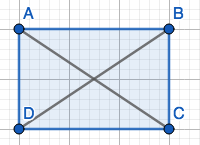

_Answer the following questions. You are encouraged to work with other students and to seek help from the instructor while working on these problems, but please write up your answers on your own._

# 1. (Boyce 3.4) Prove the Corresponding Angle Theorem 

Suppose that $\overleftrightarrow{AB}$ and $\overleftrightarrow{AC}$ are parallel lines, and that $\overleftrightarrow{AC}$ is a transverse such that $B$ and $D$ lie on the same sid eof $\overleftrightarrow{AC}$. Let E be a point on $\overleftrightarrow{AC}$ such that C is between E and A. Then $\angle BAE\cong DCE$. 

```{r, echo = F, out.width = "45%", fig.align='center', fig.cap='Two parallel lines cut by a transversal line, showing that corresponding angles are congruent'}

```

$\underline{\text{Proof:}}$

i) $\angle BAE\cong DCE\Rightarrow m\angle BAE = m\angle DCE$

Suppose $\angle BAE\cong DCE$. $\exists$ an isometry $f$ that superimposes $\angle BAE$ onto $\angle DCE$. Isometries preserve angle measure, therefore $m\angle BAE = m\angle DCE$

ii) $m\angle BAE = m\angle DCE\Rightarrow \angle BAE\cong DCE$

Let F be a point on $\overleftrightarrow{AB}$ and G be a point on $\overleftrightarrow{CD}$ such that F and G lie on the opposite side of $\overleftrightarrow{AC}$ as B and D (see **Figure 1** for reference).  

\begin{equation}\label{1ii}
\begin{split}
m\angle BAE &= 180^\circ -m\angle FAE\\
&=m\angle GCA\\
&=180^\circ-m\angle ACD\\
&= m\angle DCE
\end{split}
\end{equation}

Therefore by the Congruence and Angle measure Theorem, $\angle BAE\cong DCE$.


# 2. (Boyce 3.5) Prove or disprove the following statements. 

## a) 

If the ray $\overrightarrow{OP}$ bisects the angle $\angle AOB$, and $\angle AOP$ and $\angle BOP$ are acute, then $\angle AOB$ is obtuse. 

This statement is false. 

$\underline{\text{Proof:}}$

We defined an acute angle as being $<90^\circ$ and an obtuse angle as being $>90^\circ$. 

Consider the $m\angle AOB = 10^\circ$, then $m\angle AOP +m\angle BOP=10^\circ$. That would mean that $\angle AOP$ and $\angle BOP$ are acute, but so is $\angle AOB$. Therefore, by example, there exists a case in which $\angle AOB$ would not be obtuse. 

## b) 

If the ray $\overrightarrow{OP}$ bisects the angle $\angle AOB$, and the angel of $\angle AOB$ is obtuse, then $\angle AOP$ and $\angle BOP$ are acute. 

This statement is true. 

$\underline{\text{Proof:}}$

Another way we defined an obtuse angle was being less than straight angle. 

\begin{equation}\label{2b}
\begin{split}
180^\circ >& m\angle AOB\\
\frac{1}{2} 180^\circ >& \frac{1}{2}m\angle AOB\\
90^\circ >& m\angle AOP = m\angle BOP
\end{split}
\end{equation}

Therefore $\angle AOP$ and $\angle BOP$ are acute by definition of acute being less than $90^\circ$, and by definition of bisects being something, $\overrightarrow{OP}$, that divides something else, $\angle AOB$, into two equal parts. 

# 3. (Boyce 3.13) Prove Isosceles Traingle Theorem 

Let $\triangle ABC$ be a triangle. Then the following statements are equivalent: 

(a) $AB=AC$

(b) $\angle ABC\cong \angle ACB$

$\underline{\text{Proof:}}$

1. $AB=AC\Rightarrow\angle ABC\cong \angle ACB$

```{r, echo = F, out.width = "30%", fig.align='center', fig.cap='Triangle ABC with angle bisector AD.'}
knitr::include_graphics("img7.png")
```

Let $\overline{AD}$ be an angle bisector of $\angle BAC$. 

Then by the congruence theorem of Side-Angle-Side $\triangle ABD\cong \triangle ACD\Rightarrow \angle ABC\cong \angle ACB$. 

2. $\angle ABC\cong \angle ACB\Rightarrow AB=AC$

Suppose $\angle ABC\cong \angle ACB$. Then there is an isometry that superimposes $\angle ABC$ on $\angle ACB$. So let $f$ be that isometry $f(\angle ABC)=\angle ACB$. Isometries preserve distance. Therefore, by substitution $AB=AC$. 

Therefore $\angle ABC\cong \angle ACB\Leftrightarrow AB=AC\quad\quad\square$.

# 4. (Boyce 3.17) Prove the Rectangle Diagnals Theorem 

Let $ABCD$ be a parallelogram. Then $ABCD$ is a rectangle if and only if the diagonals of $\overline{AC}$ and $\overline{BD}$ are congruent. 

i) If ABCD is a rectangle then $\overline{AC}\cong\overline{BD}$.

Since ABCD is a rectangle, then by definition of a rectangle all four angles are equal to $90^\circ$. Meaning $m\angle ADC=m\angle DAB=m\angle CBA=m\angle BCD=90^\circ$

Since ABCD is a parallelogram, then by the Parallelogram Theorem, opposite sides are congruent. Meaning $\overline{AD}\cong \overline{BC}$ and $\overline{AB}\cong \overline{CD}$.

Consider an angle bisector $\overline{AC}$, and $\overline{BD}$.

Then by triangle congruence for Angle-Side-Angle we also know $\triangle ADC\cong \triangle DAB$, which implies that $\overline{AC}\cong\overline{BD}$. 

ii) If $\overline{AC}\cong\overline{BD}$ then ABCD is a rectangle

Since ABCD is a parallelogram, by the Parallelogram Theorem, opposite angles are congruent so,  $\angle ADC=\angle CBA$ and $\angle DAB=\angle BCD$. 

By the same theorem opposite sides are congruent so, $\overline{AD}\cong \overline{BC}$ and $\overline{AB}\cong \overline{CD}$.  

Since $\angle ADC$ and $\angle BAD$ are supplementary angles, $m\angle ADC+m\angle DAB=180^\circ$. 

Consider an angle bisector $\overline{AC}$, and $\overline{BD}$. 

Since $\overline{AD}\cong \overline{BC}$, $\overline{AB}\cong \overline{CD}$, and $\overline{AC}\cong\overline{BD}$, by the triangle congruence theorem side-side-side, we can say that $\triangle ADC\cong \triangle DAB$. 

Since $\triangle ADC\cong \triangle DAB$, then $m\angle ADC=m\angle DAB\Rightarrow 90^\circ$.

Therefore since $m\angle ADC=m\angle DAB=m\angle CBA=m\angle BCD=90^\circ$ then ABCD is a rectangle. 

Therefore parallelogram $ABCD$ is a rectangle if and only if the diagonals of $\overline{AC}$ and $\overline{BD}$ are congruent. $\quad\quad\square$

```{r, echo = F, out.width = "45%", fig.align='center', fig.cap='A parallelogram ABCD'}

```


