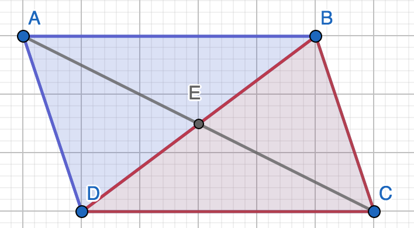

```{r setup, include = FALSE}
knitr::opts_chunk$set(echo = TRUE)
```

_Answer the following questions. You are encouraged to work with other students and to seek help from the instructor while working on these problems, but please write up your answers on your own._

### 1. (Boyce 4.1) Let $\triangle ABC$ be a triangle, and let X be a point on $\overline{AB}$ such that $\overline{CX}$ is perendicular to $\overline{AB}$. Prove that the area of $\triangle ABC$ is $\frac{1}{2}(AB\times CX)$. 

```{r, echo = F, out.width = "45%", fig.align='center', fig.cap='Triangle ABC with an added linesegment YZ, and points X,Y,Z.'}

```

Consider a line $\overline{YZ}$ parallel to $\overline{AB}$ such that C is a point on $\overline{YZ}$, and point Y is perpendicular to A and Z is perpendicular to B. 

By our axioms of area we know that the area of a rectangle is base $\times$ height. Therefore, 

$Area(AYCX)=AX\cdot CX$

$Area(BZCX)=BX\cdot CX$

We can see that $\triangle AXC\cong CYA$ because 

- $\angle AXC\cong \angle CYA$ by defining them both as perpendicular, $90^\circ$. 

- $\angle YCA\cong \angle XAC$ by alternate interior angle theorem

- $\overline{AC}=\overline{CA}$ by length axioms. 

Similarly we can say that $\triangle BXC\cong \triangle CYB$. 

Then 

$Area(BZCX)=2Area(\triangle BXC)\Rightarrow Area(\triangle BXC)=\frac{1}{2}(AC\cdot CX)$ 

and

$Area(AYCX)=2Area(\triangle AXC)\Rightarrow Area(\triangle BXC)=\frac{1}{2}(BX\cdot CX)$

Therefore, 

\begin{equation}\label{4.1}
\begin{split}
Area(\triangle ABC) &= Area(\triangle AXC) + Area(\triangle BXC)\\
&= \frac{1}{2}(AX\cdot CX)+\frac{1}{2}(BX\cdot CX)\\
&= \frac{1}{2}CX(AX+BX)\\
&= \frac{1}{2}CX(AB)
\end{split}
\end{equation}

Therefore the area of $\triangle ABC$ is $\frac{1}{2}(AB\times CX)$. $\quad\quad\square$

### 2. (Boyce 4.4) Prove that the area of a rhombus is one half the product of the lengths of the diagonals. 

```{r, echo = F, out.width = "45%", fig.align='center', fig.cap='Rhombus ABCD with point E where the diagnols intersect.'}

```

Define a rhombus ABCD, and let E be the point that $AC$ and $BD$ intersect. 

\begin{equation}\label{2.1}
\begin{split}
Area(ABCD) &= Area(\triangle ABC) + Area(\triangle CDA)\\
&= \frac{1}{2}AC(DE)+\frac{1}{2}AC(BE)\quad\quad\text{, proved in 1}\\
&= \frac{1}{2}AC(BE+DE)\\
&= \frac{1}{2}AC(BD)
\end{split}
\end{equation}

Therefore the area a rhombus is one half the product of the lengths of the diagonals. $\quad\quad\square$

**\hl{Added Note (2):}** 

We know that AC and BD are perpendicular to each other first by parallelogram theorem #4 which states that diagonals bisect each other, meaning  $\overline{AE}=\overline{EC}$  and $\overline{DE}=\overline{BE}$. Then because all sides of a rhombus have equal lengths and also by triangle congruence theorem SSS $\triangle ABE\cong \triangle CBE$. However since $\angle AEB = \angle CEB$ and $\angle AEB + \angle CEB=180^\circ$ then AC and BD must be perpendicular so the internal angles $\angle AEB = \angle CEB=90^\circ$.

### 3. (Boyce 4.7) Suppose $\overline{AB}$ and $\overline{CD}$ are parallel. Prove the area of $\triangle ABC$ is equal to the area of $\triangle ABD$.

<p>


```{r, echo = F, out.width = "35%", fig.align='center', fig.cap='Two parallel points with $H_1$ and $H_2$'}

```

</p>

We proved the area of a triangle is $\frac{1}{2}$ base $\times$ height in problem 1, so define two points to represent the height of both triangles $H_1$ and $H_2$ on $\overline{CD}$ that are perpendicular to A and B respectively. See **Figure 3** for reference. 

Since $\overline{AB}$ is parallel to $\overline{CD}$, and $H_1$ and $H_2$ are perpendicular to A and B respectively then $H_1=H_2$. 

Therefore, 

\begin{equation}\label{3.1}
\begin{split}
\frac{1}{2}AB\cdot H_1 &= \frac{1}{2}AB\cdot {H_1}\\
\Rightarrow \frac{1}{2}AB\cdot H_1 &= \frac{1}{2}AB\cdot H_2\\
\Rightarrow Area (\triangle ABC) &= Area (\triangle ABD)
\end{split}
\end{equation}

Therefore the area of $\triangle ABC$ is equal to the area of $\triangle ABD$. $\quad\quad\square$

### 4. (Boyce 4.8) Let $ABCD$ be a paralellogram. Prove that the diagnal of $\overline{BD}$ divides the parallelogram into two triangles of equal area. 

```{r, echo = F, out.width = "35%", fig.align='center', fig.cap='A parallelogram ABCD split into two triangles.'}

```

From the first problem we know the area of $\triangle DAB$ and $\triangle BCD$ are: 

$Area(\triangle DAB )= \frac{1}{2} DB\cdot AE$

$Area(\triangle  BCD )= \frac{1}{2} DB\cdot CE$

Since it is given that ABCD is a parallelogram, we know by parallelogram theorem 4 $\overline{AC}$ and $\overline{DB}$ bisect each other. Meaning that $AE=CE$. 

Therefore, 

\begin{equation}\label{4.1}
\begin{split}
\frac{1}{2} DB\cdot AE &= \frac{1}{2} DB\cdot AE\\
\Rightarrow \frac{1}{2} DB\cdot AE &= \frac{1}{2} DB\cdot CE\\
\Rightarrow Area (\triangle DAB) &= Area (\triangle BCD)
\end{split}
\end{equation}

Therefore the diagnal of $\overline{BD}$ divides the parallelogram into two triangles of equal area. $\quad\quad\square$


**\hl{Homework Rewrite (4):}** 

Since it is given that ABCD is a parallelogram, we know by parallelogram theorem (2) that $\angle DAB \cong \angle BCD$ and by parallelogram theorem (3) that $AB=CD$ and $BC=DA$.

Consider a diagnal, $\overline{BD}$ which divides the parallelogram into two triangles, by SAS congruence theorem, we know that $\triangle DAB\cong BCD$. 

Since we know that by problem 1 that a triangles area is a formula of it's length measurements and we also know that congruence preserves lengths then the diagonal of $\overline{BD}$ divides the parallelogram into two triangles of equal area. $\quad\quad\square$


