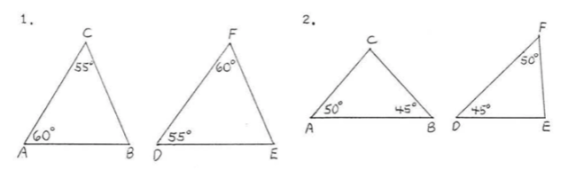

_Answer the following questions. You are encouraged to work with other students and to seek help from the instructor while working on these problems, but please write up your answers on your own._

### 1. (Africk 4.2, 1,2) Write down the similarity relations for each pair of triangles: 

```{r, echo = F, out.width = "75%", fig.align='center'}

```


### 2. (Barsamian 10.2.10) Prove that the altitude to the hypotenuse of a right triangle creates two smaller triangles that are each similar to the larger triangle. 


### 3. (Boyce 5.6) Prove the SSS Similarity Theorem: Let $\triangle ABC$ and $\triangle DEF$ be triangles such that $$\frac{AB}{DE}=\frac{BC}{EF}=\frac{CA}{FD}.$$ Then $\triangle ABC \sim \triangle DEF$. 


