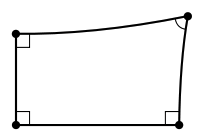
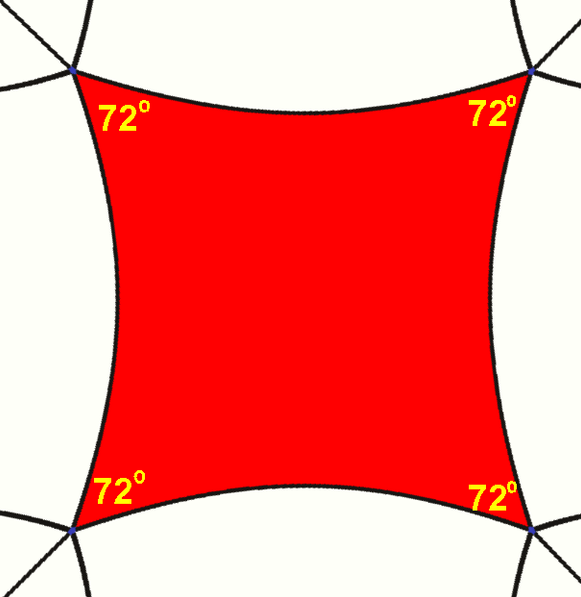

_Answer the following questions. You are encouraged to work with other students and to seek help from the instructor while working on these problems, but please write up your answers on your own._

1. (Boyce 9.6) Using the definitions of parallelogram and square, explain why parallelograms exist in hyperbolic geometry, but none of the parallelograms can be squares. 

A parallelogram can exist in hyperbolic geometry because by definition a parallelogram only needs both pairs of opposite sides to be parallel. In hyperbolic geometry this is possible since for a given line l and point P not on l, there is more than 1 line through P parallel to l. For example the Lambert quaderilatral in **Figure 1** below. 

```{r, echo = F, out.width = "35%", fig.align='center', fig.cap='Lambert quadrilateral whose forth angle is acute in hyperbolic geometry.'}

```

However a square can not exist since by definition a square is a rectangle whose sides are all equal length, and a rectangle has four right internal angles. This means the sum of the angles of a square is $360^\circ$. In class we showed that the sum of internal angles of a triangle $<180^\circ$, and since a square is also two right triangle the internals angles would be $<360^\circ$.  **Figure 2** below shows a parallelogram since it's angles are less than $90^\circ$. 

```{r, echo = F, out.width = "20%", fig.align='center', fig.cap='A parallelogram in hyperbolic geometry.'}

```

\newpage

2. (Boyce 10.1) Show that the equation for the unit sphere $S^2$ centered at the origin O is the same as the collection of points A is $\mathbb{R}^3$ such that $d_E(A,0)=1$. $$S^2=\{x^2+y^2+z^2=1\}.$$

3. 

4. (Boyce 10.4) Prove that rectangles do not exist on the sphere. 


