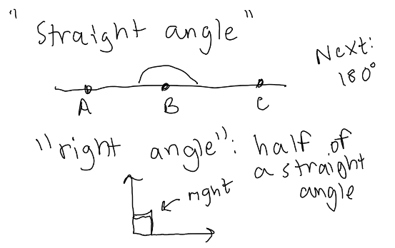
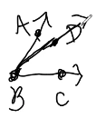

```{r set up, echo=F}
library(kableExtra) # tables 
library(magrittr) # %>% 
knitr::opts_chunk$set(error=FALSE, 
                      message= FALSE,
                      warning=FALSE)
library(LearnGeom)
```


# W1D1: Jan. 4th, 2022

## Intro 

- Adjunct at PSU and did research on geometry 

- starting from the ground up 

- for the first 6 - 7 we are going to take Euclids rules 

- then  focus on non-euclidean geometry 

This course is about : 

- building geometry from the ground up 

- explaining things with pictures

- understanding how to start from nothing and get something 

- how to use geometry 

- write proofs (mostly writing in paragraphs), abd build confidence in geometric proofs. 

Canvas 

- Boyce Notes will be our main texts 

  - Boyce has taught course for years and has made notes as up to date as possible. 
  
- Will recommend sections or problems from Alfrik and Barsamian

Calendar 

- Homework is due on Friday 

- Homework will always be based on previous week's lessons 

- Participation forms due Monday. 

- Quiz's are take home 

  - Due end of week 3 (will be posted at the end of next week)
  
    - Opportunity to present math (video, power point, ect.)
    
  - Due end of week 8
  
- For midterm and final we can proctor online or take in person. Will send an email before hand. 

Today 

- various universities never have the same geometry class 

- Boyce was apart of research group that studies how geometry fits into college curriculum. 

- class will end early (5:30) so we can fill out form that we will fill out at the end of the term. 

  - this is a "before" form, so it is okay that you dont know things
  
## Axioms 

> **Axioms** : ground rules that build on 

Axiom 1 : 4 is special 

Axiom 2 : 3 is not special 

> **model** : Definition of terms that fits rules.

Q : if the word special meant even would this model make sense? 

A : Yes. 

Q : what if special = odd 

A : No. 

Q : what if special = perfect square 

A : Yes.  

Breakout Groups : 

Axiom 1 : 4 is special 

Axiom 2 : 3 is not special

Axiom 3 : If x is special, x-1 is not special.

A. special = even , is this still true 

B. special = square 

Q : Do these models still work? 

B does not work with zero as a square. 

# W1D2: Jan. 6th, 2022

Goal of course : Use axioms to prove theorems. 

Due Monday : Participation Form

Homework #1 Due next Friday 

Note on Homework #2 : "Why" usually means "proof"  but this time a sentence or two explantion is good. (But: be careful with examples)

Example : Why are all negative numbers smaller than all positive numbers? 

(a) If a number is negative its < 0

(b) Well, -2 < 3

Last time : Euclid 300 BCE

### First 3 axioms 

(1) Two $\underline{\text{points}}$ determine every $\underline{\text{line}}$. Every line contains at least 2 points and there exists three non-$\underline{\text{collinear}}$ points. 

- will need to understand underlined terms, by a model or definition of these terms. 

(2) If B is $\underline{\text{between}}$ A and C, A, B, C are $\underline{\text{collinear}}$. If A, B, C are $\underline{\text{collinear}}$, exactly one of these $\underline{\text{points}}$ is between the other two. 

(3) Points of $\underline{\text{intersection}}$ exist if, when constructed in the $\underline{\text{plane}}$, the $\underline{\text{lines}}$ or $\underline{\text{circles}}$ necessarily cross. 

Practice : "between"


**$\underline{\text{Collinear}}$** : A, B, C are collinear if 1 point lies on the $\underline{\text{line}}$ connecting the other 2. 

Q : What is the problem with the picture on the right? 

- A, C, B is not collinear, so B is not between. 

## Break-out Groups : Definitions 

Group 1 : A point is a coordinate in space. 

Group 2 : circle is a line segement with a fixed pt around center that rotates, and has a radius. 

Group 3 : line segment has end points A and B and all points that are both between and collinear. 

- do we need collinear if we say between? no, because its in our definition of between  

Group 3 : Endpoints are points on line segment that aren't between any other 2 points. 

Will formalize definitions these definitions later : point, straight, line, circle, radius, center, line segment, endpoint 

## Part Conjectures and Conditional Statements

Workflow : Start with axioms 

$\rightarrow$ make conjecture (un-proven maybe theorem). 

$\rightarrow$ theorem is conjecture once it's "proved".

$\underline{\text{Conditional Statement}}$ : If X then Y. 

- X is the hypothesis 

- Y is conclusion 

- Ex: If X is an even number then x-1 is an odd number. 

  - Hypothesis : "x is even"
  
  - Conclusion : "x-1 is an odd number"

$\rightarrow$ Assign "truth values"

- If X then Y $\rightarrow$ T

## List of Vocabularly going with conditional statements

1. X $\rightarrow$ not X is $\underline{\text{negation}}$

- Ex: X : x is even, not X : x is not even. 

- Ex: X : all cats are orange, not X : not all cats are orange

  - not X : at least 1 cat is not orange
  
- Ex: X : If it is cloudy, then it is raining, not X : It can be both cloudy and not raining. 

**If X then Y** 

Ex: X : If Anne is a beagle then Anne is a dog. (True)

1. Converse : If Y then X.  

- Converse of X : If Anne is a dog, then Anne is a beagle. (False)

2. Contrapositive : If not Y, then not X. 

- Contrapositive of X : If Anne is not a dog, then Anne is not a beagle. (True)

- A statement and its contrapositive are logically equivalent, meaning they have the same truth value (both true or both false). 

3. Inverse : If not X then not Y. 

- Inverse of X : If Anne is not a beagal, then Anne is not a dog. (False)

- The inverse is the contrapositive of the converse $\rightarrow$ logically equivalent. 

Statement $\Leftrightarrow$ Contrapositive 

Converse $\Leftrightarrow$ Inverse 

## Biconditional: X if and only if y

Ex : If x is an even number then x-1 is an odd number. (True)

Contrapositive : If x-1 is not odd, x is not even. (True)

Converse : If x-1 is odd, x is even. (True)

Inverse : If X is not even, x-1 is not odd. (True)

Ex : X is even if and only if x-1 is odd. 

- x is even iff x-1 is odd. 

- $x\text{ is even}\Leftrightarrow x-1\text{ is odd}$

## Logic : Organizing "truth values"

**Truth Table** 

```{r tuth table, echo=F, message=F}
x <- c("T","F")
negation_not_x <- c("F","T")
truth_table <- data.frame(x,negation_not_x)  %>% 
  kable(align = "c") %>% 
  kable_minimal() %>% 
  kable_styling(full_width = F)
truth_table
```

```{r truth table 1, echo=F, message=F}
x <- c("T","T", "F", "F")
y <- c("T","F","T","F")
if_x_then_y <- c("T","F","T","T")
truth_table_2 <- data.frame(x,y,if_x_then_y) %>% 
  kable(align = "c") %>% 
  kable_minimal() %>% 
  kable_styling(full_width = F)
truth_table_2
```

- "If x is true then y is true"

Homework 

```{r truth table 2, echo=F, message=F}
x <- c("T","T", "F", "F")
y <- c("T","F","T","F")
if_x_or_y <- c("T","F","F","F")
if_x_and_y <- c("T","T","T","F")
truth_table_3 <- data.frame(x,y,if_x_or_y, if_x_and_y) %>% 
  kable(align = "c") %>% 
  kable_minimal() %>% 
  kable_styling(full_width = F)
truth_table_3
```

Inclusive vs. exclusive 

- In math we always mean inclusive, "or both"

- Common language is exclusive, "one or the other"

- Or always means both

## Lets try a Proof

Conjecture : If x is an even number then x-1 is an odd number. 

Need : 

  Definition : 
  
    even = x is even if x/2 is an integer.
    
    odd = x is odd if x/2 is not an integer.
    
    integer = positive, negative whole numebrs, and 0. (no decimals or fractions). 
    
If x (start) then y (end). 

**Table**

```{r first proof, echo=F, message=F}
Statement <- c("Suppose x is even","Then x/2 is an integer of a=x/2","So 2a=x","Then x-1 = 2a-1","So (x-1)/2=(2a-1)/2","(x-1)/2=a-1/2","a-1/2 is not an integer","Then x-1 is odd")
Reason <- c("given assumption","Definition of even.","algebra","algebra","algebra", "algebra","a is an integer", "definition of odd")
proof_table <- data.frame(Statement, Reason) %>% 
  kable(align = "c") %>% 
  kable_minimal() %>% 
  kable_styling(full_width = F)
proof_table 
```

**Paragraph**

Suppose x is even. 

Then by the definition $a=\frac{x}{2}$ is an integer. 

So $2a=x$.

Then $x-1=2a-1$ is odd. 

So $\frac{x-1}{2}=\frac{2a-1}{2}=a-\frac{1}{2}$

But a is an integer. 

So $a-\frac{1}{2}$ is not an integer.

Then x-1 is odd, by definition.

Another name for proving contrapositive is proving by way of contradiction. 

Next week this will be a geometry class. 

# W2D3: Jan. 11th, 2022

## Homework 1 Questions 

1. Truth table questions, filling in the rest of the table. 

2. b. In the future "why" means proof, but here a few sentences of explanation is fine. 

4. Question with models 

- due on Friday 

- week 1 participation form was due on Monday 

## Euclid Elements 

### Definitions 

Def.1: A _point_ is that which has no part.

- can't be broken up, has no sides 

Def.2: A _line_ is breathless length. 

- 1 dimensions, no width 

- nothing in this definition implies a line must be straight, meaning a line can be curvy 

- in this class when we say line, we really mean straight line. 

Def.3: The end of a line are _points_. 

Def.4: A _straight line_ is a line which lies evenly with the points on itself.

- line is staying on same level as points 

Def.5: A _surface_ is that which has length and breadth only. 

- 2 dimensions, can have length and width 

Def.6: The edges of a surface are lines. 

Def.7: A _plane surface_ is a surface which lies evenly with the straight lines on itself. 

Def.8: A _plane angle_ is the inclination to one another of two lines in a plane which meet one another and do not lie in a straight line. 

- going in two directions 

Def.15: A _circle_ is a plane figure contained by one line such that all the straight lines falling upon it from one point among those lying within the figure equal one another. 

- talking about radius 

### Postulates (Axioms)

[Euclid Elements](https://sites.pitt.edu/~jdnorton/teaching/HPS_0410/chapters/non_Euclid_Euclid/Elements.html)

[Geogebra](https://www.geogebra.org/geometry)

P.1: To draw a straight line from any point to any point.


P.2: To produce a finite straight line continuously in a straight line. 


P.3: To describe a circle with any center and radius. 


P.4: That all right angles equal one another. 


P.5: That, if straight line falling on two straight lines makes the interior angles on the same side less than two right angles, the two straight lines, if produced indefinitely, meet on that side on which are the angles less than the two right angles. 


## Notation 

Line segment between A, B : 

- $\overline{AB}$ , line segment 

- $\overleftrightarrow{AB}$ , infinite line 

- $\overrightarrow{AB}$ , ray that is infinite in one direction 

Length of $\overline{AB}$ is AB. 

## Axioms of Length 

Each segment $\overline{AB}$ can be assigned a positive number called its lenght AB such that 

1. Length of the unit segment is 1. 

2. AB = BA. 

3. If B is between A and C then AB+BC=AC

4. $\exists$ a point m between A ,B such that Am=mB, and call m the midpoint. 

### Conjecture

$Am=\frac{1}{2}AB$, if n is the midpoint of $\overline{AB}$. 

By axiom (3) $AB=Am+mB$. 

By axiom (4) $AB=Am+Am$. 

Algebra $AB=2Am\Rightarrow Am=\frac{AB}{2}$. 

## Angles


Ray: starts and continues forever 

Vertex: point where two lines connect 

Angles: inclination of two lines 

- angle size will be small if lines point in simialr direction, and large if point in opposite directions 

- $\angle ABC$



"Straight Angle"  is $180^\circ$.

"Right Angle" is half of a straight line.

"Acute" is less than a right angle. 

"Abtuse" bigger than a right angle. 

- needs to be between straight angle and right (between $180^\circ$ and $90^\circ$)

"Minor Angle" is smaller than a straight angle. 

"Major Angle" is larger than a straight angle.

# W2D4: Jan. 13th, 2022

## Quiz 1 

- Due Friday 1/21

- recrod a short presentation or create a slideshow explaining your proof 

- Suppose two angles are verticle. Prove that they are congruent. 

- wont be graded harshly, notes are open

- don't google it! 

## Review of Definitions 

B is a vertex. 

$BA$ and $BC$ are rays. 

$\angle ABC$ 

straight angle (180)

right angle = $\frac{1}{2}$ straight 

acute : $\angle$ less than right 

obtuse : bigger than right but not bigger than straight 

minor  : less than straight 

major : bigger than a straight 


$\angle ABC$, $\angle ABD$ are supplementary angles

- supplementary and straight strat with "s"


$\angle ABC$, $\angle ABD$ are complementary angles 


Adjacent : share vertex and a ray 


Adjacent : $\angle ABD$, $\angle DBC$

Vertical : $\angle ABD$, $\angle FBC$

Vertical : $\angle DBC$, $\angle ABF$


$\overrightarrow{\rm BP}$ biscets $\angle ABC$ if $\angle ABP$, $\angle PBC$ to have "same measure"


Perpendicular bisector 

- m is the midpoint 

- $\angle PMA$, $\angle PMB$ have the "same measure"

## Axioms of Angle Meaasure 

Every $\underline{\text{minor}}$ angle can be assigned a number between 0 and 180 called its degree measure ($m\angle ABC$) such that 

1. Right angle measures $90^\circ$

2. $m\angle ABC=m\angle CBA$

- 

3. If D is the interior of $\angle ABC$, then $m\angle ABC=m\angle ABD+m\angle BDC$

- 

4. There exists a **unique** ray that is the angle bisector of $\angle ABC$. 

- only one way to break it in half

- 

--- 

Exercise : $m\angle ABD=\frac{1}{2}m\angle ABC$

- same steps as for a midpoint 

- try for practice 

--- 

## Congruence


Not equal but "same" $\underline{\text{congruent}}$. 

$\underline{\text{Isometry}}$ : map preserves distance and angle measure. 

  othercouse : map means function from $\mathbb{R}^2$ (plane) to to itself $f((x,y))=(z,w)$.
  
### "rigid motions" 

- $\underline{\text{translation}}$ : move all the points along a vector $\overrightarrow{\rm v}$. 

    - 
    
- $\underline{\text{rotation}}$ : Pick center 0, angle $\theta$, takes P to P' on a circle with center 0, radius $\overline{OP}$, $\angle POP'=\theta$

  - 
  
- $\underline{\text{reflection}}$ : Pick line b.  

  - 
  
  - points on b dont move. 
  
  - Points not on b P goes to P' where b is perpendicular bisector of $\overline{PP'}$
  
  - m midpoint of PP', b making right angle $\overline{PP'}$
  
- Isometries are $\underline{\text{compositions}}$ of translations, rotations, reflections 

Two geometric figures are $\underline{\text{congruent}}$ if there is an isometry that superimposes one on the other. 

- perfectly match up if you can move one to match the other. 

  - $x \cong y$
  
### Congrunce Rules 
  
$\cong$ Congruence is an $\underline{\text{equivalence relations}}$ 

1. Reflective:  $x\cong x$

2. Symmetric:  If $x\cong y$ then $y\cong x$

3. Transitive:  If $x\cong y$ and $y\cong z$ then $x\cong z$. 

## Theorem (Congruence and Length)

> $\overline{AB}\cong \overline{CD}\Leftrightarrow AB=CD$ 
> 
> 1. If $\overline{AB}\cong \overline{CD}$ then $AB=CD$. (if you know congruence then you can find length)
>
> 2. If $AB=CD$ then $\overline{AB}\cong \overline{CD}$ (if you know lengths then you know congruence)

The first one will be easier becasue there is more to work with (Going cookie to crumb, instead of crumb to cookie).

### Proof 

1. If $\overline{AB}\cong \overline{CD}$ then $AB=CD$.

Suppose $\overline{AB}\cong \overline{CD}$. Then there is an isometry that superimposes $\overline{AB}$ on $\overline{CD}$. So let $f$ be that isometry : $f(\overline{AB})=\overline{CD}$. Isometrics preserve distance. The length of $f(\overline{AB})$ equals the length of $\overline{AB}$. So by substitution $CD=AB$. 

2. If $AB=CD$ then $\overline{AB}\cong \overline{CD}$. 

Suppose $AB=CD$. There is a translation along the $\overrightarrow{\rm v}$ from A to C. 

$f_1(A)=C$ (translation)


Then $f_2$ rotates $f_1(\overline{AB})$ by $\theta = \angle DCf_1(B)$, center $f_1(A)$. 


Then by the definition of rotation then $f_2(f_1(B))=D$ takes $f_2(f_1(\overline{AB}))=\overline{CD}$. Therefore they are congruent. 

- note that 2. is a constructive proof. 

Same Theorem for Angles will be done next class in groups. 

# W3D5: Jan. 17th, 2022

Can write up corrections to earn homework back by next Monday (if you want). 

## Homework 1 : Common Issues 

1. Non-collinear : For no pair is a point between the other two. 

- "For no" is important to include 

Collinear : 3 points are collinear if 1 of the points is between the other two. 

2. If P then Q, conditional statement 

"negation", X negation of x = not x. 

Result will not be an if then statement. 


"Not" : If P then Q 

```{r, echo=F}
knitr::include_graphics("img/img26.png")
```

- only the second case in the above image is If P then not Q. 

The correct answer formal logic is "P or not Q".  

Example : If Sam is a beagle then Sam is a dog. 

Negation : Sam could be a beagle and not a dog. 

## Quiz

Due on Sunday. Prove on you own, but can use your own notes. 

## Congruence

Congruence: $x\cong y$ if there is an $\underline{\text{isometry}}$ that superimposes x on y. 

- isometry is a map that preserves distance and angles 

  - translation (move without turning)
  
  - rotation 
  
  - reflection 
  
  - combination of these
  
We showed $\cong$ is an equivalence relation.

- $x\cong x$

- $x\cong y \Rightarrow y\cong x$

- $x\cong y , y \cong z\Rightarrow x\cong z$

Congruence and Length : $\overline{AB}$ , $\overline{CD}$ are line segments the $$\overline{AB}\cong\overline{CD}\Leftrightarrow AB = CD$$

Q : What makes if and only if annoying to prove? 

A : We had to prove $\overline{AB}\cong\overline{CD}\Rightarrow AB=CD$ and $AB=CD\Rightarrow \overline{AB}\cong\overline{CD}$

## Theorem: (Congruence and Angle Measure)

$\angle ABC\cong\angle DEF$ if and only if $m\angle ABC=\angle DEF$.

- note this will be used on quiz 

- formal proof will be in week 3 google doc 

## Parallell Lines


## Euclids 5th Postulate 

That, if a straight line falling on two straight lines makes the interior angles on the same side less than two right angles, the two straight lines, if produced indefinitely, meet on that side on which are the angles less than the two right angles.

Rewritten : If a line is transversal to two others, and the supplementary interior angles on one side add to less than 180$^\circ$, the lines will intersect on that side. 

Def: Parallel Lines are 2 lines (2 different lines) in the plane that do not intersect.

## Theorem : Supplementary Interior Angle Theorem 

If two lines are parallel then the supplementary interior angles add to $180^{\circ}$.

Proof: 


The lines are parallel so they don't intersect. From Euclid's 5th axiom, $m\angle ABC+m\angle DCB\geq 180^\circ$. We know $m\angle FCB+m\angle DCB=180^\circ$ and $m\angle EBC+m\angle ABC=180^\circ$. 

We know :

- $m\angle FCB+m\angle DCB=180^\circ$

- $m\angle EBC+m\angle ABC=180^\circ$

- $m\angle EBC+m\angle FCB\geq 180^\circ$

- $m\angle ABC+m\angle DCB\geq 180^\circ$

Want : $m\angle ABC + m\angle DCB=180^\circ$

We also know (with some algebra) : 

- $m\angle ABC = 180^\circ-m\angle EBC$

- $m\angle DCB = 180^\circ-m\angle FCB$

And, 

- $360^\circ-m\angle EBC-m\angle FCB\geq 180^\circ$

Then, 

- $180^\circ\geq m\angle EBC+m\angle FCB\geq180^\circ$

So $m\angle EBC+m\angle FCB=180^\circ$. 

We can use algebra to show from here that similarly $m\angle ABC + m\angle DCB=180^\circ$. 

Next class we will cover Alternating Interior Angle Theorem, and to triangles and quadrilaterals. We will learn all of triangle theorems in one day. 

# W3D6: Jan. 19th, 2022

Friday : Homework 2 is due

Sunday : Quiz 2 is due 

Monday : Participation form , and homework rework (can earn back all the corrections)

## Example 

```{r, echo=F}

```

Theorem: If 2 lines are parallel intersected a 3rd transversal lines, alternate interior angles are congruent. 

1 and 3 are alternate interior angles. 

## Proof Ingredients 

- supplementary interior angles add to $180^\circ$

- definition of supplementary angles : together they make a straight angle (add to $180^\circ$)

- congruence and angle measure theorem 

Proof :

```{r, echo = F}

```

Let our first angle be $\angle AEF$, and our 2nd be $\angle EFC$. 

("Our goal is to say something about their measure")

$\angle BEF$ and $\angle AEF$ are supplementary, so $m\angle BEF + m\angle AEF=180^\circ$. 

("What can we say about the pink and blue angle")

Since $\overline{AB}$ and $\overline{DC}$ are parallel the supplementary interior angles $\angle BEF$ and $\angle BFC$ have measure that add to $180^\circ$ by the theorem for supplementary interior angles. 

 - $m\angle AEF + m\angle BEF = 180^\circ$
 
 - $m\angle BEF + m\angle EFC = 180^\circ$
 
So $m\angle AEF + m\angle BEF = m\angle BEF + m\angle EFC$ and $m\angle AEF = m\angle EFC$.

By the Congruence and Angle measure Theorme, $\angle AEF \cong \angle EFC$. 

## Triangles 

Triangles: Consist of 3 straight line segments meeting in 3 vertices. 

```{r, echo = F}
knitr::include_graphics("img/img36.png")
```

### Types 

```{r, echo = F, out.width = "30%", fig.align='left'}

```

Equilateral: All 3 sides have the same length

```{r, echo = F, out.width = "30%", fig.align='left'}

```


Isosceles: 2 sides are the same length 

```{r, echo = F, out.width = "30%", fig.align='left'}

```

Scalene: all sides are different 

```{r, echo = F, out.width = "30%", fig.align='left'}

```

Right: Has a $90^\circ$ angle in it. 

```{r, echo = F, out.width = "30%", fig.align='left'}
knitr::include_graphics("img/img41.png")
```

Acute: All angles are less than $90^\circ$.

```{r, echo = F, out.width = "30%", fig.align='left'}

```

Obtuse: 1 angle is more than $90^\circ$

### Theorem: Angles inside a triangle add to $180^\circ$

```{r, echo = F, out.width = "30%", fig.align='center'}

```

Proof: 

The top line (that touches the top of the triangle at A) is running parallel to the base of the triangle. 

Notice that the pink angles are the same, and the red angles are the same. 

This indicates that the pink angle + the yellow angle + the red angle = a straight angle which is $180^\circ$. 

Therefore $m\angle ABC + m\angle BCA +m\angle CAB=180^\circ\quad\quad\square$. 

### Thm (SAS) 

Suppose $\triangle ABC$ and $\triangle EDF$ satisfy:

- $\overline{AB}\cong\overline{DE}$ (side)

- $\angle ABC \cong \angle DEF$

- $\overline{BD}\cong\overline{EF}$ (side)

Then $\triangle ABC \cong \triangle DEF$. 

Proof :

(Note that nothing _about_ picture can be in your proof. i.e. can't say because two things look the same in a picture ... )

```{r, echo = F, out.width = "30%", fig.align='center'}

```

We know that:

- $\overline{AB}\cong\overline{DE}$  

- $\overline{BC}\cong\overline{EF}$ 

- $\angle{ABC}\cong\angle{DEF}$

We know there is an isometry f that takes $\overline{AB}$ and superimposes it on $\overline{DE}$. 

```{r, echo = F, out.width = "30%", fig.align='center'}
knitr::include_graphics("img/img46.png")
```

- "Lets agree that if C=F then we are done, b what happens if C is on the opposite side of f?"

If C and F are on opposite sides of $\overline{AB}$ after f, do reflection g over $\overline{AB}$. 

```{r, echo = F, out.width = "30%", fig.align='center'}
knitr::include_graphics("img/img47.png")
```

Since $\angle ABC \cong \angle DEF$, c must lie on $\overrightarrow{EF}$. 

Since $\overline{BC}\cong \overline{EF}$ they have the same length so c lies on F after f, g. 

Therefore $\triangle ABC\cong \triangle DEF\quad\quad\quad\square$. 

---

We $\underline{\text{have}}$ SAS (side angle side)

There are 

- ASA (angle side angle)

- AAS (angle angle side)

- SSS (side side side)

There is not a $SSA$. 

# W4D7: Jan. 25th, 2022

# W4D8: Jan. 27th, 2022

# W5D9: Feb. 1st, 2022

# W5D10: Feb. 3rd, 2022

**MIDTERM**


