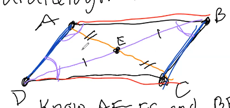
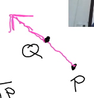

```{r set up, echo=F}
library(kableExtra) # tables 
library(magrittr) # %>% 
knitr::opts_chunk$set(error=FALSE, 
                      message= FALSE,
                      warning=FALSE)
library(LearnGeom)
```


# W1D1: Jan. 4th, 2022

## Intro 

- Adjunct at PSU and did research on geometry 

- starting from the ground up 

- for the first 6 - 7 we are going to take Euclids rules 

- then  focus on non-euclidean geometry 

This course is about : 

- building geometry from the ground up 

- explaining things with pictures

- understanding how to start from nothing and get something 

- how to use geometry 

- write proofs (mostly writing in paragraphs), abd build confidence in geometric proofs. 

Canvas 

- Boyce Notes will be our main texts 

  - Boyce has taught course for years and has made notes as up to date as possible. 
  
- Will recommend sections or problems from Alfrik and Barsamian

Calendar 

- Homework is due on Friday 

- Homework will always be based on previous week's lessons 

- Participation forms due Monday. 

- Quiz's are take home 

  - Due end of week 3 (will be posted at the end of next week)
  
    - Opportunity to present math (video, power point, ect.)
    
  - Due end of week 8
  
- For midterm and final we can proctor online or take in person. Will send an email before hand. 

Today 

- various universities never have the same geometry class 

- Boyce was apart of research group that studies how geometry fits into college curriculum. 

- class will end early (5:30) so we can fill out form that we will fill out at the end of the term. 

  - this is a "before" form, so it is okay that you dont know things
  
## Axioms 

> **Axioms** : ground rules that build on 

Axiom 1 : 4 is special 

Axiom 2 : 3 is not special 

> **model** : Definition of terms that fits rules.

Q : if the word special meant even would this model make sense? 

A : Yes. 

Q : what if special = odd 

A : No. 

Q : what if special = perfect square 

A : Yes.  

Breakout Groups : 

Axiom 1 : 4 is special 

Axiom 2 : 3 is not special

Axiom 3 : If x is special, x-1 is not special.

A. special = even , is this still true 

B. special = square 

Q : Do these models still work? 

B does not work with zero as a square. 

# W1D2: Jan. 6th, 2022

Goal of course : Use axioms to prove theorems. 

Due Monday : Participation Form

Homework #1 Due next Friday 

Note on Homework #2 : "Why" usually means "proof"  but this time a sentence or two explantion is good. (But: be careful with examples)

Example : Why are all negative numbers smaller than all positive numbers? 

(a) If a number is negative its < 0

(b) Well, -2 < 3

Last time : Euclid 300 BCE

### First 3 axioms 

(1) Two $\underline{\text{points}}$ determine every $\underline{\text{line}}$. Every line contains at least 2 points and there exists three non-$\underline{\text{collinear}}$ points. 

- will need to understand underlined terms, by a model or definition of these terms. 

(2) If B is $\underline{\text{between}}$ A and C, A, B, C are $\underline{\text{collinear}}$. If A, B, C are $\underline{\text{collinear}}$, exactly one of these $\underline{\text{points}}$ is between the other two. 

(3) Points of $\underline{\text{intersection}}$ exist if, when constructed in the $\underline{\text{plane}}$, the $\underline{\text{lines}}$ or $\underline{\text{circles}}$ necessarily cross. 

Practice : "between"


**$\underline{\text{Collinear}}$** : A, B, C are collinear if 1 point lies on the $\underline{\text{line}}$ connecting the other 2. 

Q : What is the problem with the picture on the right? 

- A, C, B is not collinear, so B is not between. 

## Break-out Groups : Definitions 

Group 1 : A point is a coordinate in space. 

Group 2 : circle is a line segement with a fixed pt around center that rotates, and has a radius. 

Group 3 : line segment has end points A and B and all points that are both between and collinear. 

- do we need collinear if we say between? no, because its in our definition of between  

Group 3 : Endpoints are points on line segment that aren't between any other 2 points. 

Will formalize definitions these definitions later : point, straight, line, circle, radius, center, line segment, endpoint 

## Part Conjectures and Conditional Statements

Workflow : Start with axioms 

$\rightarrow$ make conjecture (un-proven maybe theorem). 

$\rightarrow$ theorem is conjecture once it's "proved".

$\underline{\text{Conditional Statement}}$ : If X then Y. 

- X is the hypothesis 

- Y is conclusion 

- Ex: If X is an even number then x-1 is an odd number. 

  - Hypothesis : "x is even"
  
  - Conclusion : "x-1 is an odd number"

$\rightarrow$ Assign "truth values"

- If X then Y $\rightarrow$ T

## List of Vocabularly going with conditional statements

1. X $\rightarrow$ not X is $\underline{\text{negation}}$

- Ex: X : x is even, not X : x is not even. 

- Ex: X : all cats are orange, not X : not all cats are orange

  - not X : at least 1 cat is not orange
  
- Ex: X : If it is cloudy, then it is raining, not X : It can be both cloudy and not raining. 

**If X then Y** 

Ex: X : If Anne is a beagle then Anne is a dog. (True)

1. Converse : If Y then X.  

- Converse of X : If Anne is a dog, then Anne is a beagle. (False)

2. Contrapositive : If not Y, then not X. 

- Contrapositive of X : If Anne is not a dog, then Anne is not a beagle. (True)

- A statement and its contrapositive are logically equivalent, meaning they have the same truth value (both true or both false). 

3. Inverse : If not X then not Y. 

- Inverse of X : If Anne is not a beagal, then Anne is not a dog. (False)

- The inverse is the contrapositive of the converse $\rightarrow$ logically equivalent. 

Statement $\Leftrightarrow$ Contrapositive 

Converse $\Leftrightarrow$ Inverse 

## Biconditional: X if and only if y

Ex : If x is an even number then x-1 is an odd number. (True)

Contrapositive : If x-1 is not odd, x is not even. (True)

Converse : If x-1 is odd, x is even. (True)

Inverse : If X is not even, x-1 is not odd. (True)

Ex : X is even if and only if x-1 is odd. 

- x is even iff x-1 is odd. 

- $x\text{ is even}\Leftrightarrow x-1\text{ is odd}$

## Logic : Organizing "truth values"

**Truth Table** 

```{r tuth table, echo=F, message=F}
x <- c("T","F")
negation_not_x <- c("F","T")
truth_table <- data.frame(x,negation_not_x)  %>% 
  kable(align = "c") %>% 
  kable_minimal() %>% 
  kable_styling(full_width = F)
truth_table
```

```{r truth table 1, echo=F, message=F}
x <- c("T","T", "F", "F")
y <- c("T","F","T","F")
if_x_then_y <- c("T","F","T","T")
truth_table_2 <- data.frame(x,y,if_x_then_y) %>% 
  kable(align = "c") %>% 
  kable_minimal() %>% 
  kable_styling(full_width = F)
truth_table_2
```

- "If x is true then y is true"

Homework 

```{r truth table 2, echo=F, message=F}
x <- c("T","T", "F", "F")
y <- c("T","F","T","F")
if_x_or_y <- c("T","F","F","F")
if_x_and_y <- c("T","T","T","F")
truth_table_3 <- data.frame(x,y,if_x_or_y, if_x_and_y) %>% 
  kable(align = "c") %>% 
  kable_minimal() %>% 
  kable_styling(full_width = F)
truth_table_3
```

Inclusive vs. exclusive 

- In math we always mean inclusive, "or both"

- Common language is exclusive, "one or the other"

- Or always means both

## Lets try a Proof

Conjecture : If x is an even number then x-1 is an odd number. 

Need : 

  Definition : 
  
    even = x is even if x/2 is an integer.
    
    odd = x is odd if x/2 is not an integer.
    
    integer = positive, negative whole numebrs, and 0. (no decimals or fractions). 
    
If x (start) then y (end). 

**Table**

```{r first proof, echo=F, message=F}
Statement <- c("Suppose x is even","Then x/2 is an integer of a=x/2","So 2a=x","Then x-1 = 2a-1","So (x-1)/2=(2a-1)/2","(x-1)/2=a-1/2","a-1/2 is not an integer","Then x-1 is odd")
Reason <- c("given assumption","Definition of even.","algebra","algebra","algebra", "algebra","a is an integer", "definition of odd")
proof_table <- data.frame(Statement, Reason) %>% 
  kable(align = "c") %>% 
  kable_minimal() %>% 
  kable_styling(full_width = F)
proof_table 
```

**Paragraph**

Suppose x is even. 

Then by the definition $a=\frac{x}{2}$ is an integer. 

So $2a=x$.

Then $x-1=2a-1$ is odd. 

So $\frac{x-1}{2}=\frac{2a-1}{2}=a-\frac{1}{2}$

But a is an integer. 

So $a-\frac{1}{2}$ is not an integer.

Then x-1 is odd, by definition.

Another name for proving contrapositive is proving by way of contradiction. 

Next week this will be a geometry class. 

# <span style="color: darksalmon;">W2D3: Jan. 11th, 2022</span>

## Homework 1 Questions 

1. Truth table questions, filling in the rest of the table. 

2. b. In the future "why" means proof, but here a few sentences of explanation is fine. 

4. Question with models 

- due on Friday 

- week 1 participation form was due on Monday 

## Euclid Elements 

### Definitions 

Def.1: A _point_ is that which has no part.

- can't be broken up, has no sides 

Def.2: A _line_ is breathless length. 

- 1 dimensions, no width 

- nothing in this definition implies a line must be straight, meaning a line can be curvy 

- in this class when we say line, we really mean straight line. 

Def.3: The end of a line are _points_. 

Def.4: A _straight line_ is a line which lies evenly with the points on itself.

- line is staying on same level as points 

Def.5: A _surface_ is that which has length and breadth only. 

- 2 dimensions, can have length and width 

Def.6: The edges of a surface are lines. 

Def.7: A _plane surface_ is a surface which lies evenly with the straight lines on itself. 

Def.8: A _plane angle_ is the inclination to one another of two lines in a plane which meet one another and do not lie in a straight line. 

- going in two directions 

Def.15: A _circle_ is a plane figure contained by one line such that all the straight lines falling upon it from one point among those lying within the figure equal one another. 

- talking about radius 

### Postulates (Axioms)

[Euclid Elements](https://sites.pitt.edu/~jdnorton/teaching/HPS_0410/chapters/non_Euclid_Euclid/Elements.html)

[Geogebra](https://www.geogebra.org/geometry)

P.1: To draw a straight line from any point to any point.


P.2: To produce a finite straight line continuously in a straight line. 


P.3: To describe a circle with any center and radius. 


P.4: That all right angles equal one another. 


P.5: That, if straight line falling on two straight lines makes the interior angles on the same side less than two right angles, the two straight lines, if produced indefinitely, meet on that side on which are the angles less than the two right angles. 


## Notation 

Line segment between A, B : 

- $\overline{AB}$ , line segment 

- $\overleftrightarrow{AB}$ , infinite line 

- $\overrightarrow{AB}$ , ray that is infinite in one direction 

Length of $\overline{AB}$ is AB. 

## Axioms of Length 

Each segment $\overline{AB}$ can be assigned a positive number called its lenght AB such that 

1. Length of the unit segment is 1. 

2. AB = BA. 

3. If B is between A and C then AB+BC=AC

4. $\exists$ a point m between A ,B such that Am=mB, and call m the midpoint. 

### Conjecture

$Am=\frac{1}{2}AB$, if n is the midpoint of $\overline{AB}$. 

By axiom (3) $AB=Am+mB$. 

By axiom (4) $AB=Am+Am$. 

Algebra $AB=2Am\Rightarrow Am=\frac{AB}{2}$. 

## Angles


Ray: starts and continues forever 

Vertex: point where two lines connect 

Angles: inclination of two lines 

- angle size will be small if lines point in simialr direction, and large if point in opposite directions 

- $\angle ABC$


"Straight Angle"  is $180^\circ$.

"Right Angle" is half of a straight line.

"Acute" is less than a right angle. 

"Abtuse" bigger than a right angle. 

- needs to be between straight angle and right (between $180^\circ$ and $90^\circ$)

"Minor Angle" is smaller than a straight angle. 

"Major Angle" is larger than a straight angle.

# <span style="color: darksalmon;">W2D4: Jan. 13th, 2022</span>

## Quiz 1 

- Due Friday 1/21

- recrod a short presentation or create a slideshow explaining your proof 

- Suppose two angles are verticle. Prove that they are congruent. 

- wont be graded harshly, notes are open

- don't google it! 

## Review of Definitions 

B is a vertex. 

$BA$ and $BC$ are rays. 

$\angle ABC$ 

straight angle (180)

right angle = $\frac{1}{2}$ straight 

acute : $\angle$ less than right 

obtuse : bigger than right but not bigger than straight 

minor  : less than straight 

major : bigger than a straight 


$\angle ABC$, $\angle ABD$ are supplementary angles

- supplementary and straight strat with "s"


$\angle ABC$, $\angle ABD$ are complementary angles 


Adjacent : share vertex and a ray 


Adjacent : $\angle ABD$, $\angle DBC$

Vertical : $\angle ABD$, $\angle FBC$

Vertical : $\angle DBC$, $\angle ABF$


$\overrightarrow{\rm BP}$ biscets $\angle ABC$ if $\angle ABP$, $\angle PBC$ to have "same measure"


Perpendicular bisector 

- m is the midpoint 

- $\angle PMA$, $\angle PMB$ have the "same measure"

## Axioms of Angle Meaasure 

Every $\underline{\text{minor}}$ angle can be assigned a number between 0 and 180 called its degree measure ($m\angle ABC$) such that 

1. Right angle measures $90^\circ$

2. $m\angle ABC=m\angle CBA$

- 

3. If D is the interior of $\angle ABC$, then $m\angle ABC=m\angle ABD+m\angle BDC$

- 

4. There exists a **unique** ray that is the angle bisector of $\angle ABC$. 

- only one way to break it in half

- 

--- 

Exercise : $m\angle ABD=\frac{1}{2}m\angle ABC$

- same steps as for a midpoint 

- try for practice 

--- 

## Congruence


Not equal but "same" $\underline{\text{congruent}}$. 

$\underline{\text{Isometry}}$ : map preserves distance and angle measure. 

  othercouse : map means function from $\mathbb{R}^2$ (plane) to to itself $f((x,y))=(z,w)$.
  
### "rigid motions" 

- $\underline{\text{translation}}$ : move all the points along a vector $\overrightarrow{\rm v}$. 

    - 
    
- $\underline{\text{rotation}}$ : Pick center 0, angle $\theta$, takes P to P' on a circle with center 0, radius $\overline{OP}$, $\angle POP'=\theta$

  - 
  
- $\underline{\text{reflection}}$ : Pick line b.  

  - 
  
  - points on b dont move. 
  
  - Points not on b P goes to P' where b is perpendicular bisector of $\overline{PP'}$
  
  - m midpoint of PP', b making right angle $\overline{PP'}$
  
- Isometries are $\underline{\text{compositions}}$ of translations, rotations, reflections 

Two geometric figures are $\underline{\text{congruent}}$ if there is an isometry that superimposes one on the other. 

- perfectly match up if you can move one to match the other. 

  - $x \cong y$
  
### Congrunce Rules 
  
$\cong$ Congruence is an $\underline{\text{equivalence relations}}$ 

1. Reflective:  $x\cong x$

2. Symmetric:  If $x\cong y$ then $y\cong x$

3. Transitive:  If $x\cong y$ and $y\cong z$ then $x\cong z$. 

## Theorem (Congruence and Length)

> $\overline{AB}\cong \overline{CD}\Leftrightarrow AB=CD$ 
> 
> 1. If $\overline{AB}\cong \overline{CD}$ then $AB=CD$. (if you know congruence then you can find length)
>
> 2. If $AB=CD$ then $\overline{AB}\cong \overline{CD}$ (if you know lengths then you know congruence)

The first one will be easier becasue there is more to work with (Going cookie to crumb, instead of crumb to cookie).

### Proof 

1. If $\overline{AB}\cong \overline{CD}$ then $AB=CD$.

Suppose $\overline{AB}\cong \overline{CD}$. Then there is an isometry that superimposes $\overline{AB}$ on $\overline{CD}$. So let $f$ be that isometry : $f(\overline{AB})=\overline{CD}$. Isometrics preserve distance. The length of $f(\overline{AB})$ equals the length of $\overline{AB}$. So by substitution $CD=AB$. 

2. If $AB=CD$ then $\overline{AB}\cong \overline{CD}$. 

Suppose $AB=CD$. There is a translation along the $\overrightarrow{\rm v}$ from A to C. 

$f_1(A)=C$ (translation)


Then $f_2$ rotates $f_1(\overline{AB})$ by $\theta = \angle DCf_1(B)$, center $f_1(A)$. 


Then by the definition of rotation then $f_2(f_1(B))=D$ takes $f_2(f_1(\overline{AB}))=\overline{CD}$. Therefore they are congruent. 

- note that 2. is a constructive proof. 

Same Theorem for Angles will be done next class in groups. 

# W3D5: Jan. 17th, 2022

Can write up corrections to earn homework back by next Monday (if you want). 

## Homework 1 : Common Issues 

1. Non-collinear : For no pair is a point between the other two. 

- "For no" is important to include 

Collinear : 3 points are collinear if 1 of the points is between the other two. 

2. If P then Q, conditional statement 

"negation", X negation of x = not x. 

Result will not be an if then statement. 


"Not" : If P then Q 

```{r, echo=F}

```

- only the second case in the above image is If P then not Q. 

The correct answer formal logic is "P or not Q".  

Example : If Sam is a beagle then Sam is a dog. 

Negation : Sam could be a beagle and not a dog. 

## Quiz

Due on Sunday. Prove on you own, but can use your own notes. 

## Congruence

Congruence: $x\cong y$ if there is an $\underline{\text{isometry}}$ that superimposes x on y. 

- isometry is a map that preserves distance and angles 

  - translation (move without turning)
  
  - rotation 
  
  - reflection 
  
  - combination of these
  
We showed $\cong$ is an equivalence relation.

- $x\cong x$

- $x\cong y \Rightarrow y\cong x$

- $x\cong y , y \cong z\Rightarrow x\cong z$

Congruence and Length : $\overline{AB}$ , $\overline{CD}$ are line segments the $$\overline{AB}\cong\overline{CD}\Leftrightarrow AB = CD$$

Q : What makes if and only if annoying to prove? 

A : We had to prove $\overline{AB}\cong\overline{CD}\Rightarrow AB=CD$ and $AB=CD\Rightarrow \overline{AB}\cong\overline{CD}$

## Theorem: (Congruence and Angle Measure)

$\angle ABC\cong\angle DEF$ if and only if $m\angle ABC=\angle DEF$.

- note this will be used on quiz 

- formal proof will be in week 3 google doc 

## Parallell Lines


## Euclids 5th Postulate 

That, if a straight line falling on two straight lines makes the interior angles on the same side less than two right angles, the two straight lines, if produced indefinitely, meet on that side on which are the angles less than the two right angles.

Rewritten : If a line is transversal to two others, and the supplementary interior angles on one side add to less than 180$^\circ$, the lines will intersect on that side. 

Def: Parallel Lines are 2 lines (2 different lines) in the plane that do not intersect.

## Theorem : Supplementary Interior Angle Theorem 

If two lines are parallel then the supplementary interior angles add to $180^{\circ}$.

Proof: 


The lines are parallel so they don't intersect. From Euclid's 5th axiom, $m\angle ABC+m\angle DCB\geq 180^\circ$. We know $m\angle FCB+m\angle DCB=180^\circ$ and $m\angle EBC+m\angle ABC=180^\circ$. 

We know :

- $m\angle FCB+m\angle DCB=180^\circ$

- $m\angle EBC+m\angle ABC=180^\circ$

- $m\angle EBC+m\angle FCB\geq 180^\circ$

- $m\angle ABC+m\angle DCB\geq 180^\circ$

Want : $m\angle ABC + m\angle DCB=180^\circ$

We also know (with some algebra) : 

- $m\angle ABC = 180^\circ-m\angle EBC$

- $m\angle DCB = 180^\circ-m\angle FCB$

And, 

- $360^\circ-m\angle EBC-m\angle FCB\geq 180^\circ$

Then, 

- $180^\circ\geq m\angle EBC+m\angle FCB\geq180^\circ$

So $m\angle EBC+m\angle FCB=180^\circ$. 

We can use algebra to show from here that similarly $m\angle ABC + m\angle DCB=180^\circ$. 

Next class we will cover Alternating Interior Angle Theorem, and to triangles and quadrilaterals. We will learn all of triangle theorems in one day. 

# W3D6: Jan. 19th, 2022

Friday : Homework 2 is due

Sunday : Quiz 2 is due 

Monday : Participation form , and homework rework (can earn back all the corrections)

## Example 

```{r, echo=F}
knitr::include_graphics("img/img34.png")
```

Theorem: If 2 lines are parallel intersected a 3rd transversal lines, alternate interior angles are congruent. 

1 and 3 are alternate interior angles. 

## Proof Ingredients 

- supplementary interior angles add to $180^\circ$

- definition of supplementary angles : together they make a straight angle (add to $180^\circ$)

- congruence and angle measure theorem 

Proof :

```{r, echo = F}
knitr::include_graphics("img/img35.png")
```

Let our first angle be $\angle AEF$, and our 2nd be $\angle EFC$. 

("Our goal is to say something about their measure")

$\angle BEF$ and $\angle AEF$ are supplementary, so $m\angle BEF + m\angle AEF=180^\circ$. 

("What can we say about the pink and blue angle")

Since $\overline{AB}$ and $\overline{DC}$ are parallel the supplementary interior angles $\angle BEF$ and $\angle BFC$ have measure that add to $180^\circ$ by the theorem for supplementary interior angles. 

 - $m\angle AEF + m\angle BEF = 180^\circ$
 
 - $m\angle BEF + m\angle EFC = 180^\circ$
 
So $m\angle AEF + m\angle BEF = m\angle BEF + m\angle EFC$ and $m\angle AEF = m\angle EFC$.

By the Congruence and Angle measure Theorme, $\angle AEF \cong \angle EFC$. 

## Triangles 

Triangles: Consist of 3 straight line segments meeting in 3 vertices. 

```{r, echo = F}

```

### Types 

```{r, echo = F, out.width = "30%", fig.align='left'}
knitr::include_graphics("img/img37.png")
```

Equilateral: All 3 sides have the same length

```{r, echo = F, out.width = "30%", fig.align='left'}
knitr::include_graphics("img/img38.png")
```


Isosceles: 2 sides are the same length 

```{r, echo = F, out.width = "30%", fig.align='left'}
knitr::include_graphics("img/img39.png")
```

Scalene: all sides are different 

```{r, echo = F, out.width = "30%", fig.align='left'}
knitr::include_graphics("img/img40.png")
```

Right: Has a $90^\circ$ angle in it. 

```{r, echo = F, out.width = "30%", fig.align='left'}

```

Acute: All angles are less than $90^\circ$.

```{r, echo = F, out.width = "30%", fig.align='left'}
knitr::include_graphics("img/img42.png")
```

Obtuse: 1 angle is more than $90^\circ$

### Theorem: Angles inside a triangle add to $180^\circ$

```{r, echo = F, out.width = "30%", fig.align='center'}
knitr::include_graphics("img/img44.png")
```

Proof: 

The top line (that touches the top of the triangle at A) is running parallel to the base of the triangle. 

Notice that the pink angles are the same, and the red angles are the same. 

This indicates that the pink angle + the yellow angle + the red angle = a straight angle which is $180^\circ$. 

Therefore $m\angle ABC + m\angle BCA +m\angle CAB=180^\circ\quad\quad\square$. 

### Thm (SAS) 

Suppose $\triangle ABC$ and $\triangle EDF$ satisfy:

- $\overline{AB}\cong\overline{DE}$ (side)

- $\angle ABC \cong \angle DEF$

- $\overline{BD}\cong\overline{EF}$ (side)

Then $\triangle ABC \cong \triangle DEF$. 

Proof :

(Note that nothing _about_ picture can be in your proof. i.e. can't say because two things look the same in a picture ... )

```{r, echo = F, out.width = "30%", fig.align='center'}
knitr::include_graphics("img/img45.png")
```

We know that:

- $\overline{AB}\cong\overline{DE}$  

- $\overline{BC}\cong\overline{EF}$ 

- $\angle{ABC}\cong\angle{DEF}$

We know there is an isometry f that takes $\overline{AB}$ and superimposes it on $\overline{DE}$. 

```{r, echo = F, out.width = "30%", fig.align='center'}

```

- "Lets agree that if C=F then we are done, b what happens if C is on the opposite side of f?"

If C and F are on opposite sides of $\overline{AB}$ after f, do reflection g over $\overline{AB}$. 

```{r, echo = F, out.width = "30%", fig.align='center'}

```

Since $\angle ABC \cong \angle DEF$, c must lie on $\overrightarrow{EF}$. 

Since $\overline{BC}\cong \overline{EF}$ they have the same length so c lies on F after f, g. 

Therefore $\triangle ABC\cong \triangle DEF\quad\quad\quad\square$. 

---

We $\underline{\text{have}}$ SAS (side angle side)

There are 

- ASA (angle side angle)

- AAS (angle angle side)

- SSS (side side side)

There is not a $SSA$. 

# <span style="color: darksalmon;">W4D7: Jan. 25th, 2022</span>

Quiz's will be graded by Wednesday and Thurseday. 

- taking time to give a lot of feedback

Homework 1 Solutions will be posted today after class

- HW2 Solutions will be posted next Tuesday 

- Professors solutions may be different than ours 

Boyce Notes will have all of our definitions and theorems that we can use. 

Thursday we will discuss the midterm. 

## Homework 2 

1. $A=B$, $AB=0$

Conj: If $A=B$ then $AB=0$. 

Proof: Suppose by way of contradiction (BWOC) that $AB\ne 0$. 

Then $AB>0$. 

Suppose we choose C so B is between A and C. 

Then $AB+BC=AC$ (length axiom 3)

$\Rightarrow AB+BC=BC$ (A=B)

$\Rightarrow AB=0$ (subtract $BC$ from both sides)

This contradicts our assumption that $AB>0$. So $AB=0$. $\quad\quad \square$

2. $A=C$, $m\angle ABC=0$

$\angle ABC$, A,C are equal. 

$\Rightarrow m\angle ABC$. 

Imagine you have $\angle ABC$, and imagine there is an $\angle DBC$


- D could also be and angle bisector 

$m\angle BDC = m\angle DBA+m\angle ABC$

- whereever you see a C or A you are allowed to replace it with the other one. 

$\Rightarrow m\angle BDC = m\angle DBC+m\angle ABC$

$\Rightarrow 0=m\angle ABC$.

Email homework corrections by next Monday. 

## Quadrilaterals 

4 sided figure in the plane (drawn on a flat surface), where the edges are straight lines. 


### Parallelogram

Both pairs of opposite sides are parallel 


### Trapezoid 

At least 1 pair of opposite sides is parallel. 


### Rhombus

Parallelogram, all sides are same length 


### Rectangle 

Parallelogram (whose opposite sides have equal length) whose internal angles are all right angles. 

### Square 

Rectangle whose sides are all equal length. 

## Parallelogram Thm

(part 4 of Boyce Notes)

Let ABCD be a parallelogram. The following are equivalent: 

1. ABCD is a parallelogram. (opposite sides are parallel)

2. $\angle DAB \cong \angle BCD$ and $\angle ABC\cong \angle CDA$ (angles that are across from each other are congruent)

3. $AB=CD$ and $BC=DA$ (opposite sides have equal measure)

4. $\overline{AC}$ and $\overline{BD}$ bisect each other. (diagnals bisect each other)

(8 things we would have to show in a proof, but there is a way we can prove this that is the least amount of work)


Meaning, we only need to prove four parts. 

### Toolkit

* Euclid's 5th axiom 

* Angles and parallel lines 

  - vertical angles are congruent 
  
  - alternate interior angles are congruent 
  
  - corresponding angles are congruent 
  
  - supplementary anglesa add to 180 
  
* Triangles : Angles add to  180 

  - Congruence: SAS, ASA,SSS, AAS 
  
### Proof - part 1

$1\Rightarrow 2$ : If ABCD is a parallelogram then 

- $\angle DAB\cong \angle BCD$

- $\angle ABC\cong \angle CDA$


  
We also know, 

$m\angle ABC+m\angle BCD=180^\circ $ (1)

$m\angle DAB+m\angle ABC=180^\circ $ (2)

$m\angle BCD+m\angle CDA=180^\circ $ (3)

$m\angle DAB+m\angle CDA=180^\circ $ (4) (written on pictures)

All of these hold because they are supplementary interior angles. 

Using these equations, 

$m\angle BCD=180^\circ -m\angle ABC=m\angle DAB$

By the congruence and angle measure theorem $\angle DAB\cong \angle BCD$. 

Similarly 

$m\angle ABC=180^\circ -m\angle BCD=m\angle CDA$

By the congruence and angle measure theorem $\angle ABC\cong \angle BCD$. 

### Proof - part 2

($s\Rightarrow 3$) ABCD is a quadrilateral. 

If $\angle DAB\cong \angle BCD$ and 

$\angle ABC\cong \angle CDA$ then 

$AB=CD$ and $BC=DA$

(we don't know anything about parallel, so we will use our triangle theorems)


$\triangle ABC$ and $\triangle CDA$

- It is important the order of the letters for triangles 

- want $\overline{AB}$ to match $\overline{CD}$

- and $\overline{BC}$ to match $\overline{DA}$

We know that $AC=CA$ and that $\angle ABC\cong \angle CDA$ ... 


"What can we say about $\angle$ 1, 2, 3, and 4"

$m\angle 1+m\angle 2 = m\angle 3+m\angle 4$ by assumption. 

We also know $m\angle ABC+ m\angle 2 + m\angle 3=180^\circ$ and 

$m\angle CDA+ m\angle 1 + m\angle 4=180^\circ$

We can also say, 

$m\angle 2+m\angle 3=180^\circ-m\angle ABC$

$m\angle 1+m\angle 4=180^\circ-m\angle CDA$

So, $(m\angle 2+m\angle 3=m\angle 1+m\angle 4)$

Also, $(m\angle 1+m\angle 4=m\angle 2+m\angle 3)$ 

Then, $(m\angle 2+m\angle 3=m\angle 1+m\angle 4)-(m\angle 1+m\angle 4=m\angle 2+m\angle 3)$

$\Rightarrow = m\angle 3-m\angle 1=m\angle 1-m\angle 3$

$\Rightarrow = 2m\angle 3=2m\angle 1 - m\angle 3= m\angle 1$

Now we can say that $\triangle ABC \cong \triangle CDA$, hence their sides have the same lengths. Therefore $AB=CD$ and $BC=DA$.

# <span style="color: darksalmon;">W4D8: Jan. 27th, 2022</span>

Midterm will be during class on Thurseday, and can be taken remotely. 

Remote Exam Two Options: 

1. Email before exam so we can print 

2. Post at start of Exam, and look at it on screen. 

Everyone will need to be  on zoom with camera on. 

Midterm will go through triangle theorm stuff, meaning non of the parallelorgram stuff will be on the midterm. 

Next class will be half review, and half new material. 

## Practice Problems 

1. Is “x divides y evenly” a model for the following Axiom System:

-  2 is better than 8

-  3 is better than 9

- If x is better than y and y is better than z then x is better than z.

True or False (explain your answers):

- If 2 lines segments are congruent then one is a translation of the other in the plane.

- If <ABC and <CBD are supplementary then B is between A and D.

- The negation of “If it is snowing then it is cold” is “If it is not cold then it is not snowing.” 

Finish this proof:

- Claim: Alternate interior angles are congruent.

- Proof: Suppose AB and CD are parallel, E is between A and B, and F is between C and D. We will show that <AEF is congruent to <DFE.

- Because <AEF and <BEF are supplementary, then their measures add to 180 degrees.

- Because (fill in the blank), the measure of <BEF and <DFE add to 180 degrees. 

- Then m<AEF+m<BEF=m<BEF + m<DFE so m<AEF = m<DFE.

- So because (fill in the blank), <AEF and <DFE are congruent.

Prove that if BD is a bisector of <ABC, then m<ABD = (½)m<ABC. 

## HW 3 (Due Week 4)

If ABCD is a parallelogram ABCD is a rectangle $\Leftrightarrow$ $\overline{AC}$ and $\overline{BD}$ are congruent. 

- know it's a parallelogram, and everything in that theorem

  - opposite angles are congruent
  
  - opposite sides have the same length
  
  - diagnols bisect each other
  
Claim: If $\overline{AC}\cong  \overline{BD}$ then ABCD is a rectangle. 


If we know that the orange angle is a right angle then we also know that the green angle is a right angle because of the parallelogram theorem that says opposite angles are congruent. 

We also know that if the orange angle is then the pink angle on the same side is also a right angle becasue same side interior angles add up to 180. 

The remaining pink angle is also a right angle becasue of the parallelorgram theorem that says opposite angles are congruent. 

Hint : $m\angle 1+m\angle 2 = 180$, can you show that $\angle 1\cong\angle 2$. If you could show that, then that would tell us that they both have the same measurement of 90 degrees because two things that are the same size that add up to 180 are 90. 

Note: This is the sort of "large proof" that wouldn't be on the exam. Something we spend a week on, not just do in an hour. 

## Last Class: Parallelogram Theorem Proof

ABCD is a parallelogram. Then the following are equivalent that the folloing are equivalent (TFAE). 

Let ABCD be a parallelogram. The following are equivalent: 

1. ABCD is a parallelogram. (opposite sides are parallel)

2. $\angle DAB \cong \angle BCD$ and $\angle ABC\cong \angle CDA$ (angles that are across from each other are congruent)

3. $AB=CD$ and $BC=DA$ (opposite sides have equal measure)

4. $\overline{AC}$ and $\overline{BD}$ bisect each other. (diagnals bisect each other)

Last class we proved 

- 1 $\Rightarrow$ 2

- 2 $\Rightarrow$ 3

Now we need to prove 

- 3 $\Rightarrow$ 4

- 4 $\Rightarrow$ 1

Then everything implies everything. 

### 3 $\Rightarrow$ 4

Suppose $AB=CD$, $BC=DA$


Want to show: $\overline{CD}$, $\overline{BD}$ bisect each other. 

In other words: $AE=EC$, $DE=EB$

By SSS, $\triangle ABD \cong \triangle CDB$ and $\triangle ABC\cong \triangle CDA$

By ASA $\triangle AED \cong \triangle CEB$

$\Rightarrow AE=CE$, $DE=BE$

### 4 $\Rightarrow$ 1

If $\overline{AC}$, $\overline{BD}$ bisect each other then ABCD is a parallelogram. 



Know $AE=EC$ and $BE=ED$

Suppose $AC$, $BD$ bisect each other. 

Vertical angle theorem $\Rightarrow$ $\angle AED\cong \angle BEC$, $\angle AEB\cong \angle CED$.  

SAS $\Rightarrow \triangle AED\cong \triangle CEB$ and $\triangle AEB\cong \triangle CED$.


Want: $m\angle 1 +m\angle 2 + m\angle 3 + m\angle 4=180^\circ$

$m\triangle ACD= m\angle 1 +m\angle 2 + m\angle 3 + m\angle 4=180^\circ$

$\Rightarrow$ By Euclid's 5th axiom since the supplementary interior angles for $\overline{AB}$ and $\overline{CD}$ add to $180^\circ$, $\overline{AB}$ is parallel to $\overline{CD}$. Same argument $\overline{AD}$m $\overline{BC}$ are parallel. 

## Prove area of a trapezoid is bh

Activity 1: Use the axioms of area to prove that the area of a trapezoid is the product of its height and the arithmetic mean of its bases.

## Axioms of Area

1. To every polygonal region (space enclosed by straight lines in the plane) there corresponds a unique positive number called $\underline{area}$. 

2. If 2 tirangles are congruent their areas are equal. 

3. If $R=R_1\cup R_2$ and $R_1\cap R_2$ is a finite number of segments or points, then the area of $R$ is the sum of the areas of $R_1+R_2$. 

4. The area of a rectangle is its base times its height. 

## Ex: 

Conjecture: The area of a parallelogram ABCD is $AB=CX$ where $X$ is on the $\overleftrightarrow{AB}$ and $\overleftrightarrow{CX}$ is perpendicular to $\overleftrightarrow{AB}$. 


Axiom 3: Area ($\triangle AYD$) + Area($AXCY$) + Area ($\triangle BXC$) = Area($ABCD$) (equation 1)

Axiom 4: Area(AXC) = $AC\cdot CX$.

Axiom 2: $\triangle AYD\cong \triangle CXB$ then areas are equal. 


Put Z on $\overleftrightarrow{AB}$ so that $\overline{DZ}$ is perpendicular to $\overleftrightarrow{AB}$. 

Area(AZDY) = Area($\triangle AZD$) + Area($\triangle AYD$)


AAS $\Rightarrow$ 2Area($\triangle AZD$)

$AY\cdot DY=2 Area(\triangle AYD)$

Parallelogram : 

- Rectangle: $AX\cdot CX$

- Triangle: $\frac{1}{2}(AY\cdot DY)$

Equation 1: Area ($\triangle AYD$) + Area($AXCY$) + Area ($\triangle BXC$) = Area($ABCD$)

$\Rightarrow AX\cdot CX+(\frac{1}{2}(AY\cdot DY))+(\frac{1}{2}(AY\cdot DY))=AB\cdot CX$

$\Rightarrow AX\cdot CX+CX\cdot DY=AB\cdot CX$

$\Rightarrow AX\cdot CX+XB\cdot CX$

$\Rightarrow (AX+XB)CX$

- $(AX+XB)$ Line segment, axiom 3

## Circle Prep. 

How do we get the area of a circle? 

- Can you cut a circle into areas of squares and triangles? 


- Begin to reach a problem in  calculus called a limit. 

# W5D9: Feb. 1st, 2022

Homework 3 is graded, and homework 2 solutions are available in Canvas. 

Write answers on a seperate sheet of paper, and supmit to canvas. 

## Axioms of Area 

1. Every polygon region has $\underline{\text{area}}$. 

2. If 2 triangels are congruent then their areas are equal. 

    - (this is important)

3. $R=R_1\cup R_2$ and $R_1\cap R_2$ is a finite set of segments/ points, area ($R_1$) + area ($R_2$) = area R. 

4. Area of rectangle is base $\times$ height. 

## Area of a paralelogram 

Last time we showed the area of a parallelogram. We had a couple strategies. 


- cut area into two triangels and a rectangle. 

- used area axiom 4

- then showed two triangles are congruent 

- used area axiom 2 

- extended line and showed two triangles and used axiom 2 and 3 

## Homework 4

Area of triangle formula. 

On homework we can use:

- use axioms 

- use parallelogram formula (showed together)

- use previous problems 

## Practice: Area of a trapezoid

For trapezoids, we have 1 set of parallel lines (or more). 


Find the area of a trapezoid. 

Aim: height $\times$ "mean of the bases" : $\frac{AB+CD}{2}$

$AB\cdot H+\frac{1}{2}CX\cdot H+\frac{1}{2}DY\cdot H=H(AB+\frac{1}{2}CX+\frac{1}{2}DY)$

End goal : $H(\frac{1}{2}(AB+CD))$


You can notice that $DC-AB=CX+DY$, and use a substitution to get where you want to go.

Another way to look at this: 

$=H(\frac{1}{2}AB+\frac{1}{2}AB+\frac{1}{2}CX+\frac{1}{2}DY)$

$=H(\frac{1}{2}(AB+AB+CX+DY))$, notice $AB+CX+DY=CD$

Therefore $H(\frac{1}{2}(AB+CD))$. 

This is how the homework is, and now we can use area of trapezoid. 

## Similarity 

Isometries: reflect, rotate, translate 

- don't change lengths or angles 

$\rightarrow$ Congruence 

Idea for similarity: proportional 

$\rightarrow$ Dilation - pick a center point and either shrink or expand 

Imagine we pick a point p, then we move on a straight line towards p or expand away from P. 

Pick a "scaling factor" $K>0$. 

- If K is less than 1: shrink 

- If K is larger than 1: expanding 

- If K = 1, Do nothing 



Pick center P, where does Q go? 

- Draw a line segment $\overline{QP}$

- Dilation has caling factor k, move Q to Q' so that $Q'P=kQP$

- Pick $Q'$ on $\overrightarrow{PQ}$ with that distance

Similarity: 2 figures are similar if one can be superimposed on the other by a dilation and a sequence of isometries. 

Next: AAA Theorem (similar triangels)

- do a diaation and then some congruence 

## Midterm Review

No geometric inequalities or quadrilaterials. 

Wont be given new axioms. 

Material Covered: 

- Week 1

  - What's an inverse and a converse

- Week 2

  - parallel lines
  
  - angles 
  
- Week 3

  - triangles 
  
Want: 

- triangle theorems 

- line theorems (complementary interior ... )

- Eucilids 5th Axiom 

- Truth Values and negation (like homework)

- theorems about parallel lines

Types of Questions 

1. True / False (full page)

- where you have to explain choice. (Not a proof)

2. Fill in the proof. (2)

- need to fill in a theorem or algebra step 

- look at picture and tell why ... 

3. Proofs (2)

- one short 

- one medium (like homework)

## Practice Questions

(week 5 google doc)

### Round 1: True or False

If ABC and DEF are triangles, with <ABC congruent to <DEF, AB = DE, and BC = EF, then ABC and DEF are congruent.

- True, SAS

If ABC and DEF are triangles, with <ABC congruent to <DEF, AC = DF, and BC = EF, then ABC and DEF are congruent.

- False, ASS is not a $\triangle$ congruence

The negation of “If a dragon is red then it breathes fire” is “If a dragon is red then it does not breathe fire.”

- False, the negation would be "A dragon can be red, and not breathe fire". 

The contrapositive of “If a dragon is red then it breathes fire” is “If a dragon is not red then it does not breathe fire.”

- False, this is the inverse. The Contrapositive would be "If a dragon does not breathe fire, then it is not red". 

### Round 2: Fill in the Proof

Claim: Alternate interior angles are congruent.
            
Proof: Suppose AB is parallel to CD, and both are intersected by line EF. Say E is between A and B, and F is between C and D. We will show <AEF is congruent to <DFE. First, <DFE is supplementary to <CFE so m<DFE +m<CFE = 180 degrees. Next (missing step: m<DFE + m<CFE = 180 because they are supplementary ). Then m<DFE + m<CFE = m<CFE+m<AEF, so m<DFE = m<AEF. (missing step: By Congruence and Measure Angle Theorem ) <AEF and <DFE are congruent.

Claim: If A=B then AB = 0.

Proof: Suppose A=B. Choose another point C. By Axiom 3 of Measure for Line Segments, AC = AB + BC. (missing step: BC = AB + BC) So AB = 0. 

### Round 3: Definitions and Theorems

Vertical angles are congruent. 

Alternate Exterior Angles are congruent. 

The AAS Theorem states that if two angles and any side of one triangle are congruent to two angles and any side of another triangle, then the triangles are congruent. 

An isometry preserves angles and distances. 

# W5D10: Feb. 3rd, 2022

**MIDTERM**


